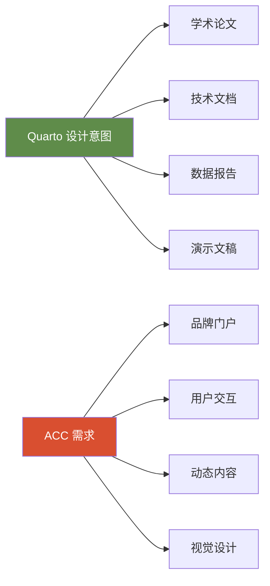
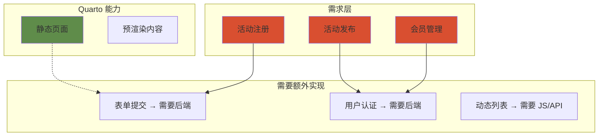
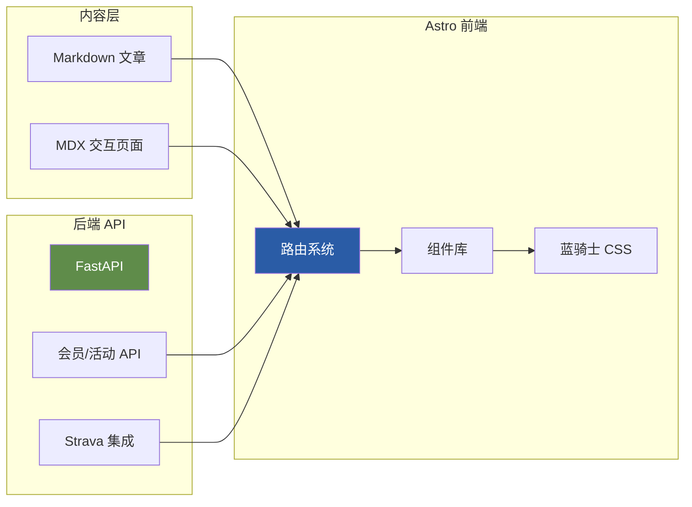
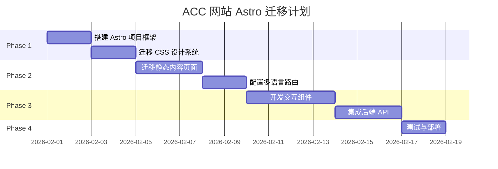

# ACC 门户网站架构诊断报告

> **诊断日期**: 2026年1月27日  
> **项目**: ACC (Across Cycling Club Munich) 俱乐部门户网站  
> **当前技术栈**: Quarto + FastAPI (后端雏形)

---

## 📋 执行摘要

| 维度 | 结论 |
|------|------|
| **技术适配性** | ⚠️ 中等适配，存在显著限制 |
| **核心判断** | Quarto 适合 **内容发布**，但 **不适合** 动态门户网站 |
| **建议路径** | 🔄 **架构分离**: 保留 Quarto 做内容，引入前端框架做交互 |

> [!IMPORTANT]
> **核心结论**: Quarto 被设计为 **技术文档发布工具**，而非 **动态 Web 应用框架**。强行用 Quarto 实现高度定制化的门户网站，是一种 **Over-Engineering in the Wrong Direction** — 不是功能过度，而是 **工具错用**。

---

## 1. 技术适配性分析

### 1.1 Quarto 的设计定位



**Quarto 的核心优势**:
- ✅ Markdown 转 HTML/PDF 的高效渲染
- ✅ 代码块执行与嵌入 (Python/R)
- ✅ 学术出版格式支持 (引用、交叉引用)
- ✅ 多语言文档生成

**Quarto 的内在局限**:
- ❌ CSS 覆盖困难 — Bootstrap/Quarto 内部样式优先级高
- ❌ 组件化能力弱 — 无法创建可复用的 UI 组件
- ❌ JavaScript 集成不友好 — 必须通过 `include-after-body` 注入
- ❌ 路由控制有限 — 基于文件系统，无动态路由

### 1.2 当前适配问题的根本原因

您遇到的 [blaue_reiter.css](file:///d:/my_projects/acc_clubhub/assets/styles/blaue_reiter.css) 适配困难，根源在于：

```css
/* 您定义的变量 */
:root {
    --color-bg-canvas: #E8E4D9;
    --font-heading: 'Jost', 'Futura', sans-serif;
}

/* Quarto 内部会生成类似这样的样式 */
body {
    background-color: #fff !important;  /* Bootstrap 默认 */
    font-family: -apple-system, ... ;     /* Quarto 主题覆盖 */
}
```

> [!CAUTION]
> **冲突链**: Quarto 渲染时会注入 **Bootstrap 5 + Quarto Theme CSS**，这些样式的 specificity (优先级) 往往高于您的自定义 CSS。要覆盖它们，您需要：
> 1. 使用 `!important` (反模式)
> 2. 深入理解 Quarto 的 SCSS 主题系统
> 3. 创建完整的自定义 Quarto Theme

### 1.3 是否存在 Over-Engineering?

| 问题 | 分析 |
|------|------|
| **工具选择** | 用 Quarto 做门户网站本身不是 Over-Engineering，而是 **工具错配** |
| **设计愿景** | [atomic_guide.md](file:///d:/my_projects/acc_clubhub/assets/styles/atomic_guide/atomic_guide.md) 的"蓝骑士"设计系统非常优秀，但需要能支撑它的技术栈 |
| **后端设计** | [app.py](file:///d:/my_projects/acc_clubhub/backend/app.py) 中的 FastAPI 后端是正确方向 |

---

## 2. 功能实现可行性分析

### 2.1 五大内容板块

| 板块 | Quarto 实现难度 | 关键障碍 |
|------|----------------|----------|
| **车影骑踪** (影像/访谈) | 🟡 中等 | 图片 gallery 需要额外 JS；视频嵌入可行 |
| **慕城日常** (活动发布) | 🔴 困难 | 需要动态数据，Quarto 是静态生成 |
| **器械知识** (指南/教程) | 🟢 容易 | 这是 Quarto 的强项 |
| **科学训练** (方法论) | 🟢 容易 | 同上，技术文档类 |
| **骑行路线库** (数据库) | 🔴 困难 | 需要搜索/筛选，Quarto 无原生支持 |

### 2.2 用户交互功能



> [!WARNING]
> **关键差距**: Quarto 生成的是 **静态 HTML**。任何需要用户输入、数据提交的功能，都必须依赖外部服务或自建后端。您已经开始了 [backend/](file:///d:/my_projects/acc_clubhub/backend) 的 FastAPI 开发，这是正确的方向。

### 2.3 路线库实现障碍

根据 [ACC_2026焕新计划_企划书.md](file:///d:/my_projects/acc_clubhub/docs/ACC_2026%E7%84%95%E6%96%B0%E8%AE%A1%E5%88%92_%E4%BC%81%E5%88%92%E4%B9%A6.md) 中的需求：

> "收集成员推荐的优质路线，形成**可搜索的数据库**"

**Quarto 的方案**:
- 用 `.qmd` 写每条路线
- 编译时生成静态 listing 页面
- 搜索靠浏览器端 JS (有限)

**实际需求**:
- 按难度、距离、爬升筛选
- 动态添加新路线
- Strava API 同步

**结论**: Quarto 可以做简单的路线展示，但 **可搜索数据库** 超出其能力范围。

### 2.4 Strava API 集成复杂度

| 集成方式 | 可行性 | 说明 |
|---------|--------|------|
| **Build-time** | 🟡 可行但受限 | GitHub Actions 中调用 API，数据写入 JSON，Quarto 渲染 |
| **Run-time** | 🔴 需要后端 | 用户授权、实时同步需要服务器 |

您当前的 [data/strava_cache](file:///d:/my_projects/acc_clubhub/data/strava_cache) 目录和 GitHub Workflow 暗示了 **Build-time** 方案。这对MVP可行，但：
- OAuth 授权流程需要后端
- 实时性受限于构建频率

---

## 3. 定制化与扩展性分析

### 3.1 风格适配困难的根本原因

您的 [atomic_guide.md](file:///d:/my_projects/acc_clubhub/assets/styles/atomic_guide/atomic_guide.md) 定义了一套精美的 "蓝骑士2.0" 设计系统，包括：

- 康定斯基风格的色彩原子
- 倾斜的动能按钮
- 手绘风格图标
- 呼吸动画效果

**为什么在 Quarto 中难以实现：**

```
┌─────────────────────────────────────────────┐
│  您的设计意图                                │
│  ┌─────────────────────────────────────┐    │
│  │  斜切角分割、笔触边缘、色块拼接      │    │
│  └─────────────────────────────────────┘    │
│                    ↓                         │
│  Quarto 的渲染管道                           │
│  ┌─────────────────────────────────────┐    │
│  │  .qmd → Pandoc → Bootstrap HTML     │    │
│  │  (注入大量预设 class 和结构)        │    │
│  └─────────────────────────────────────┘    │
│                    ↓                         │
│  输出结果                                    │
│  ┌─────────────────────────────────────┐    │
│  │  预设结构 + 您的 CSS = 冲突/折衷    │    │
│  └─────────────────────────────────────┘    │
└─────────────────────────────────────────────┘
```

### 3.2 技术债务风险

| 风险类型 | 当前状态 | 长期影响 |
|---------|---------|---------|
| **CSS Hack 堆积** | 已开始 (`!important` 使用) | 维护成本指数级上升 |
| **多语言维护** | 三套 `_quarto.yml` | 配置漂移风险 |
| **内容与样式耦合** | Quarto shortcode 依赖 | 迁移困难 |

### 3.3 设计灵活性评估

- **能做到**: 更换颜色、字体、简单布局调整
- **有难度**: 自定义组件、复杂动画、非标准布局
- **几乎不可能**: 完全脱离 Quarto 主题结构的设计

---

## 4. 替代方案建议

### 4.1 方案对比

| 方案 | 适用场景 | 开发成本 | 维护成本 | 设计自由度 |
|------|---------|---------|---------|-----------|
| **继续 Quarto** | 纯文档站点 | 低 | 中 | ⭐⭐ |
| **Astro + MDX** | 内容为主 + 轻交互 | 中 | 低 | ⭐⭐⭐⭐ |
| **Next.js** | 全功能 Web App | 高 | 中 | ⭐⭐⭐⭐⭐ |
| **Hugo + 自定义模板** | 静态站点 + 定制外观 | 中 | 低 | ⭐⭐⭐ |

### 4.2 推荐方案: Astro 框架

> [!TIP]
> **核心推荐**: 使用 **Astro** 作为新的前端框架

**推荐理由**:

1. **内容优先设计** — 原生支持 Markdown/MDX
2. **零 JS 默认** — 静态输出，需要时才注入 JS (Islands Architecture)
3. **组件化能力** — 可复用 React/Vue/Svelte 组件
4. **设计自由** — 100% 控制 HTML/CSS 输出
5. **多语言支持** — 内置 i18n 路由

**架构示意**:



### 4.3 迁移成本评估

| 迁移项 | 工作量 | 复杂度 |
|-------|-------|-------|
| **内容文件** | 2-4 小时 | 低 — 大部分 `.qmd` 改 `.md/.mdx` |
| **CSS 系统** | 4-8 小时 | 低 — 直接复用，无需覆盖技巧 |
| **多语言配置** | 2-4 小时 | 中 — 需配置 Astro i18n |
| **后端集成** | 保持现状 | 无 — FastAPI 独立运行 |
| **学习曲线** | 8-16 小时 | 中 — Astro 文档清晰 |

**总估计**: 2-3 个周末可完成核心迁移

### 4.4 长期优势对比

| 维度 | Quarto 现状 | Astro 迁移后 |
|------|------------|-------------|
| **设计自由度** | 受限于主题 | 完全控制 |
| **交互功能** | 需要 Hack | 原生支持 |
| **构建性能** | 较慢 | 极快 (部分 Hydration) |
| **SEO 优化** | 基础 | 精细控制 |
| **社区生态** | 学术向 | Web 开发向 |

---

## 5. 行动建议

### 5.1 如果继续使用 Quarto

> [!WARNING]
> 仅在以下情况下推荐继续：
> - 团队对 Quarto 非常熟悉
> - 愿意接受设计妥协
> - 交互功能可以延后或外包

**优化路径**:

1. **创建 Quarto SCSS 主题** — 而非覆盖式 CSS
   ```yaml
   format:
     html:
       theme: 
         - cosmo
         - custom-theme.scss  # 扩展而非覆盖
   ```

2. **分离动态功能** — 交互页面用独立 HTML + JS
3. **简化设计目标** — 放弃复杂动效，回归 Quarto 友好的风格

### 5.2 如果切换到 Astro (推荐)

**迁移路线图**:



**风险控制**:

1. **并行开发** — 保留 Quarto 站点运行，Astro 在新分支开发
2. **内容共享** — Markdown 内容可同时用于两套系统
3. **渐进迁移** — 先验证一个板块，再推广

---

## 📌 最终建议

基于您的需求分析 (来自 [ACC_2026焕新计划_企划书.md](file:///d:/my_projects/acc_clubhub/docs/ACC_2026%E7%84%95%E6%96%B0%E8%AE%A1%E5%88%92_%E4%BC%81%E5%88%92%E4%B9%A6.md)):

| 需求 | Quarto 满足度 | Astro 满足度 |
|-----|--------------|-------------|
| 专业形象展示 | 60% | 95% |
| 活动注册系统 | 20% | 85% |
| 路线数据库 | 25% | 90% |
| 设计自由度 | 40% | 95% |
| 维护友好性 | 70% | 85% |

> [!IMPORTANT]
> **最终建议**: 
> 1. **短期** (1-2 周): 评估团队对 Astro 的接受度，完成 Proof of Concept
> 2. **中期** (1 个月): 完成核心页面迁移，保留 FastAPI 后端
> 3. **长期**: 在 Astro 基础上实现完整的"蓝骑士2.0"设计愿景

Quarto 是优秀的工具，但它的设计哲学是 **"让内容创作者专注于内容"**。当您需要 **完全控制视觉表现和用户交互** 时，选择一个为此设计的框架会更加高效和可持续。

---

*诊断报告完成 — 如需进一步技术细节或 Astro 迁移 PoC，请告知。*
