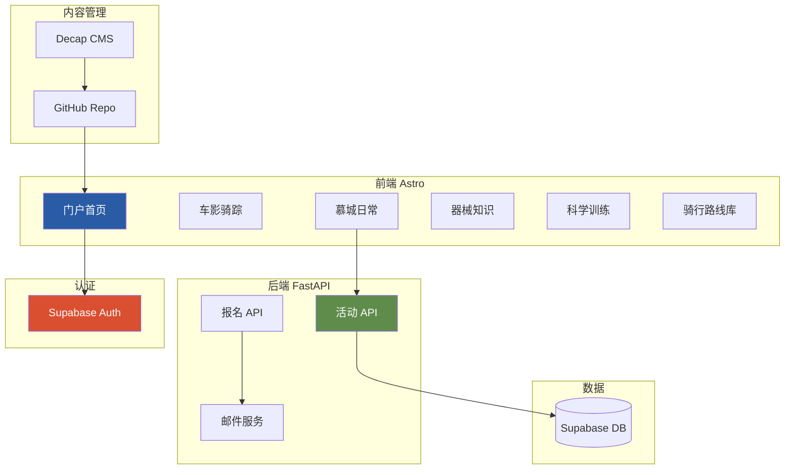

# ACC ClubHub 架构重建总纲

> **版本**: 1.0  
> **创建日期**: 2026年1月27日  
> **项目**: ACC (Across Cycling Club Munich) 门户网站  
> **状态**: 待实施

---

## 第一部分：重建动机

### 1.1 原架构问题诊断

**原技术栈**: Quarto

| 问题维度 | 具体表现 |
|---------|---------|
| **工具定位错配** | Quarto 为技术文档设计，非动态门户 |
| **CSS 适配困难** | Bootstrap + Quarto 主题优先级高，覆盖需大量 `!important` |
| **交互能力有限** | 静态生成，表单/登录需外部服务 |
| **设计自由度低** | 无法实现蓝骑士设计系统的倾斜、手绘效果 |

### 1.2 目标架构



---

## 第二部分：内容板块映射

基于 [ACC_2026焕新计划_企划书.md](file:///d:/my_projects/acc_clubhub/docs/ACC_2026%E7%84%95%E6%96%B0%E8%AE%A1%E5%88%92_%E4%BC%81%E5%88%92%E4%B9%A6.md) 的五大板块：

| 内容板块 | 路由 | 功能描述 | 技术实现 |
|---------|------|---------|---------|
| **🎬 车影骑踪** | `/media` | 影像资料、骑友访谈、翻山越岭记录 | Decap CMS + VideoEmbed 组件 |
| **🚴 慕城日常** | `/events` | Social Ride、Training Day、活动报名 | FastAPI + 报名表单 |
| **🔧 器械知识** | `/knowledge/gear` | 购车指南、维修 Workshop、新品解读 | Decap CMS + 成员贡献 |
| **📊 科学训练** | `/knowledge/training` | 训练方法论、安全科普 | Decap CMS + 成员贡献 |
| **🗺️ 骑行路线库** | `/routes` | 可搜索路线数据库、Strava/Komoot 链接 | Fuse.js 搜索 + CMS |

### 页面结构

```
/                          # 首页 (中央导航 Hub)
├── /events                # 慕城日常 - 活动列表
│   └── /events/[id]       # 活动详情 + 报名
├── /media                 # 车影骑踪 - 影像库
│   └── /media/[slug]      # 影像/访谈详情
├── /knowledge             # 知识中心
│   ├── /knowledge/gear    # 器械知识
│   └── /knowledge/training # 科学训练
├── /routes                # 骑行路线库 (带搜索)
│   └── /routes/[slug]     # 路线详情
├── /about                 # 关于 ACC
└── /admin                 # Decap CMS 后台
```

---

## 第三部分：技术栈详解

### 3.1 前端: Astro

| 选择理由 |
|---------|
| 静态优先，SEO 友好 |
| 原生支持 Markdown/MDX |
| Islands Architecture — 按需加载 JS |
| 100% 控制 HTML/CSS 输出 |
| 内置 i18n 多语言路由 |

### 3.2 后端: FastAPI

```python
# 核心 API 端点
POST /api/auth/login          # Supabase JWT 验证
GET  /api/events              # 活动列表
POST /api/events              # 创建活动 (admin)
POST /api/events/{id}/rsvp    # 活动报名
GET  /api/events/{id}/rsvps   # 报名列表 (admin)
```

### 3.3 认证: Supabase Auth

- Google OAuth ✅
- GitHub OAuth ✅
- Email/Password ✅
- 免费 50,000 MAU

### 3.4 内容管理: Decap CMS + 成员贡献

- 可视化编辑器
- GitHub 存储
- 无需服务器

> [!IMPORTANT]
> **成员内容贡献流程** (器械知识 / 科学训练):
> 1. 管理员在 GitHub 仓库 Settings → Collaborators 添加成员 GitHub 账号
> 2. 成员访问 `/admin` 并通过 GitHub OAuth 登录
> 3. 在可视化编辑器中撰写文章
> 4. 点击「发布」→ 自动提交到 GitHub → 网站更新

> [!NOTE]
> **两套独立登录系统**:
> | 系统 | 入口 | 用途 | 对象 |
> |------|------|------|------|
> | Supabase Auth | 网站前台 | 活动报名、评论 | 所有访客 |
> | Decap CMS | `/admin` | 撰写/发布文章 | GitHub 仓库 Collaborators |

### 3.5 邮件: Resend

- 免费 3,000 封/月
- 开发者友好 API
- 良好送达率

---

## 第四部分：实施计划 (基于 Iterative Plan)

> **状态更新**: 截至 2026-01-29，Layer 1 (骨架)、Layer 2 (样式)、Layer 3 (内容) 均已完成。Sveltia CMS 与多语言 (i18n) 基础已就绪。

### 4.1 实施分层概览

| 层次 | 描述 | 状态 | 关键技术 |
|------|------|------|----------|
| **Layer 1: 骨架** | 基础 Astro 项目结构、路由规划、布局组件 | ✅ 已完成 | Astro, Components |
| **Layer 2: 样式** | 迁移 "蓝骑士" 设计系统，实现 CSS 变量与组件样式 | ✅ 已完成 | CSS Variables, Responsive Design |
| **Layer 3: 内容** | 搭建 CMS、定义内容集合、实现 i18n 动态渲染 | ✅ 已完成 | Sveltia CMS, Content Collections, i18n |
| **Layer 4: 功能** | 用户认证、活动报名系统、路线搜索、评论互动 | 🚧 待启动 | FastAPI, Supabase, Fuse.js |

### 4.2 当前文件结构 (Layer 3 完成态)

```
acc_clubhub/
├── frontend/
│   ├── public/
│   │   ├── admin/
│   │   │   ├── index.html            # Sveltia CMS 入口
│   │   │   └── config.yml            # CMS 配置 (GitHub OAuth)
│   │   └── images/
│   ├── src/
│   │   ├── content.config.ts         # 内容集合定义 (Zod Schema)
│   │   ├── content/                  # 内容文件 (Media, Knowledge, Routes)
│   │   │   ├── media/zh/*.md
│   │   │   └── ...
│   │   ├── components/               # UI 组件 (Header, Footer, Cards...)
│   │   ├── layouts/                  # 布局 (BaseLayout, ArticleLayout)
│   │   ├── lib/
│   │   │   └── i18n.ts               # 多语言工具
│   │   ├── pages/
│   │   │   └── [lang]/               # 动态多语言路由
│   │   │       ├── index.astro
│   │   │       ├── media/
│   │   │       ├── knowledge/
│   │   │       └── routes/
│   │   └── styles/                   # 样式库
│   │       └── blaue-reiter.css
│   └── astro.config.mjs
├── backend/                          # FastAPI 后端 (Layer 4 重点)
│   ├── app.py
│   └── ...
└── docs/                             # 项目文档
```

### 4.3 下一阶段重点 (Layer 4)

#### 4.1 认证与用户系统
- **目标**: 实现基于 Supabase 的用户注册/登录 (Google/GitHub/Email)。
- **交付物**: `frontend/src/lib/auth.ts`, `backend/auth.py`, 登录 UI 组件。

#### 4.2 慕城日常 (Events) & 报名
- **目标**: 完整的活动发布与报名流程。
- **交付物**: `backend/routes/events.py`, `backend/routes/rsvp.py`, 邮件通知服务。

#### 4.3 路线搜索与互动
- **目标**: 路线多维度筛选与模糊搜索，视频嵌入与评论功能。
- **交付物**: Fuse.js 搜索集成, Giscus 评论组件, VideoEmbed 组件。

---

## 第五部分：验证清单 (已更新)

| 阶段 | 验证项 | 状态 |
|------|-------|------|
| **Layer 1** | 网站骨架搭建，页面路由互通 | ✅ PASS |
| **Layer 2** | 蓝骑士设计风格落地，响应式适配 | ✅ PASS |
| **Layer 3** | CMS 后台可访问，支持 GitHub 登录 | ✅ PASS |
| **Layer 3** | 多语言 (zh/en/de) 内容发布与动态渲染 | ✅ PASS |
| **Layer 3** | CI/CD 流水线 (Vitest + Playwright) | ✅ PASS |
| **Layer 4** | 用户登录与鉴权 | ⬜ TODO |
| **Layer 4** | 活动创建与报名流程 | ⬜ TODO |
| **Layer 4** | 路线搜索功能 | ⬜ TODO |

---

## 附录

### A. 相关文档

| 文档 | 路径 |
|------|------|
| ACC 2026 企划书 | [ACC_2026焕新计划_企划书.md](file:///d:/my_projects/acc_clubhub/docs/ACC_2026%E7%84%95%E6%96%B0%E8%AE%A1%E5%88%92_%E4%BC%81%E5%88%92%E4%B9%A6.md) |
| 蓝骑士设计指南 | [atomic_guide.md](file:///d:/my_projects/acc_clubhub/assets/styles/atomic_guide/atomic_guide.md) |
| 现有 CSS | [blaue_reiter.css](file:///d:/my_projects/acc_clubhub/assets/styles/blaue_reiter.css) |
| 现有后端模型 | [backend/models.py](file:///d:/my_projects/acc_clubhub/backend/models.py) |

### B. 外部服务

| 服务 | 用途 | 注册链接 |
|------|------|---------|
| Supabase | 认证 + 数据库 | supabase.com |
| Resend | 邮件发送 | resend.com |
| Vercel | 前端部署 | vercel.com |
| Railway | 后端部署 | railway.app |

### C. 决策记录

| 日期 | 决策 | 理由 |
|------|------|------|
| 2026-01-27 | 放弃 Quarto | 设计自由度不足，无法支持交互功能 |
| 2026-01-27 | 不复用 REMS 前端 | 需要统一设计风格，避免跳转 |
| 2026-01-27 | 选择 Astro | 静态优先、设计自由、i18n 支持 |
| 2026-01-27 | 选择 Supabase | Google/GitHub OAuth，免费额度大 |
