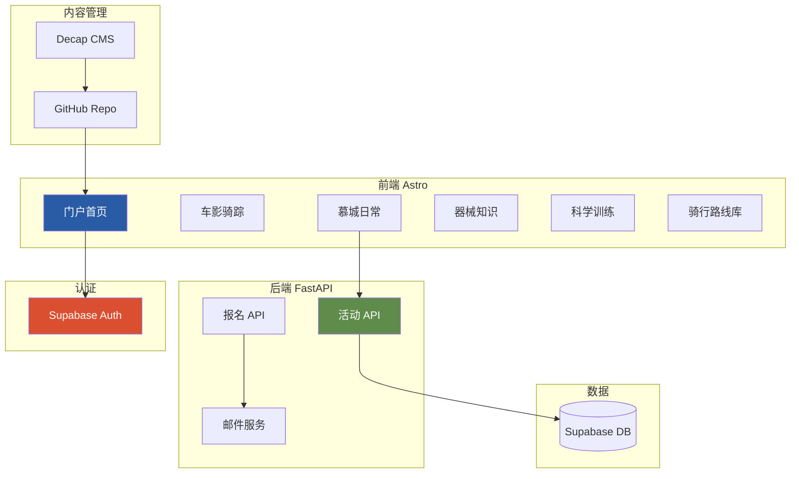
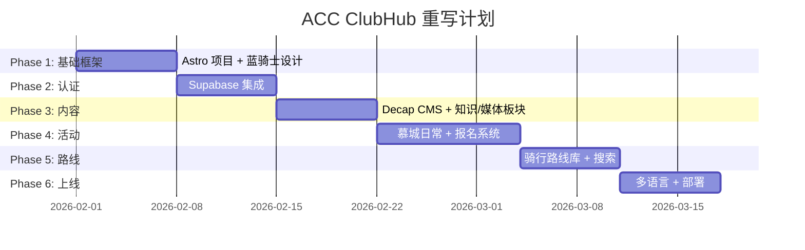

# ACC ClubHub 架构重建总纲

> **版本**: 1.0  
> **创建日期**: 2026年1月27日  
> **项目**: ACC (Across Cycling Club Munich) 门户网站  
> **状态**: 待实施

---

## 第一部分：重建动机

### 1.1 原架构问题诊断

**原技术栈**: Quarto

| 问题维度 | 具体表现 |
|---------|---------|
| **工具定位错配** | Quarto 为技术文档设计，非动态门户 |
| **CSS 适配困难** | Bootstrap + Quarto 主题优先级高，覆盖需大量 `!important` |
| **交互能力有限** | 静态生成，表单/登录需外部服务 |
| **设计自由度低** | 无法实现蓝骑士设计系统的倾斜、手绘效果 |

### 1.2 目标架构



---

## 第二部分：内容板块映射

基于 [ACC_2026焕新计划_企划书.md](file:///d:/my_projects/acc_clubhub/docs/ACC_2026%E7%84%95%E6%96%B0%E8%AE%A1%E5%88%92_%E4%BC%81%E5%88%92%E4%B9%A6.md) 的五大板块：

| 内容板块 | 路由 | 功能描述 | 技术实现 |
|---------|------|---------|---------|
| **🎬 车影骑踪** | `/media` | 影像资料、骑友访谈、翻山越岭记录 | Decap CMS + VideoEmbed 组件 |
| **🚴 慕城日常** | `/events` | Social Ride、Training Day、活动报名 | FastAPI + 报名表单 |
| **🔧 器械知识** | `/knowledge/gear` | 购车指南、维修 Workshop、新品解读 | Decap CMS + 成员贡献 |
| **📊 科学训练** | `/knowledge/training` | 训练方法论、安全科普 | Decap CMS + 成员贡献 |
| **🗺️ 骑行路线库** | `/routes` | 可搜索路线数据库、Strava/Komoot 链接 | Fuse.js 搜索 + CMS |

### 页面结构

```
/                          # 首页 (中央导航 Hub)
├── /events                # 慕城日常 - 活动列表
│   └── /events/[id]       # 活动详情 + 报名
├── /media                 # 车影骑踪 - 影像库
│   └── /media/[slug]      # 影像/访谈详情
├── /knowledge             # 知识中心
│   ├── /knowledge/gear    # 器械知识
│   └── /knowledge/training # 科学训练
├── /routes                # 骑行路线库 (带搜索)
│   └── /routes/[slug]     # 路线详情
├── /about                 # 关于 ACC
└── /admin                 # Decap CMS 后台
```

---

## 第三部分：技术栈详解

### 3.1 前端: Astro

| 选择理由 |
|---------|
| 静态优先，SEO 友好 |
| 原生支持 Markdown/MDX |
| Islands Architecture — 按需加载 JS |
| 100% 控制 HTML/CSS 输出 |
| 内置 i18n 多语言路由 |

### 3.2 后端: FastAPI

```python
# 核心 API 端点
POST /api/auth/login          # Supabase JWT 验证
GET  /api/events              # 活动列表
POST /api/events              # 创建活动 (admin)
POST /api/events/{id}/rsvp    # 活动报名
GET  /api/events/{id}/rsvps   # 报名列表 (admin)
```

### 3.3 认证: Supabase Auth

- Google OAuth ✅
- GitHub OAuth ✅
- Email/Password ✅
- 免费 50,000 MAU

### 3.4 内容管理: Decap CMS + 成员贡献

- 可视化编辑器
- GitHub 存储
- 无需服务器

> [!IMPORTANT]
> **成员内容贡献流程** (器械知识 / 科学训练):
> 1. 管理员在 GitHub 仓库 Settings → Collaborators 添加成员 GitHub 账号
> 2. 成员访问 `/admin` 并通过 GitHub OAuth 登录
> 3. 在可视化编辑器中撰写文章
> 4. 点击「发布」→ 自动提交到 GitHub → 网站更新

> [!NOTE]
> **两套独立登录系统**:
> | 系统 | 入口 | 用途 | 对象 |
> |------|------|------|------|
> | Supabase Auth | 网站前台 | 活动报名、评论 | 所有访客 |
> | Decap CMS | `/admin` | 撰写/发布文章 | GitHub 仓库 Collaborators |

### 3.5 邮件: Resend

- 免费 3,000 封/月
- 开发者友好 API
- 良好送达率

---

## 第四部分：实施计划

### 4.1 文件结构

```
acc_clubhub/
├── frontend/                     # Astro 前端
│   ├── src/
│   │   ├── layouts/
│   │   │   └── BaseLayout.astro
│   │   ├── components/
│   │   │   ├── Header.astro
│   │   │   ├── Footer.astro
│   │   │   ├── VideoEmbed.astro
│   │   │   ├── EventCard.astro
│   │   │   ├── RouteCard.astro
│   │   │   └── RegisterForm.astro
│   │   ├── pages/
│   │   │   ├── index.astro
│   │   │   ├── events/
│   │   │   │   ├── index.astro
│   │   │   │   └── [id].astro
│   │   │   ├── media/
│   │   │   │   ├── index.astro
│   │   │   │   └── [slug].astro
│   │   │   ├── knowledge/
│   │   │   │   ├── gear/
│   │   │   │   └── training/
│   │   │   ├── routes/
│   │   │   │   ├── index.astro
│   │   │   │   └── [slug].astro
│   │   │   └── about.astro
│   │   ├── content/              # Astro Content Collections
│   │   │   ├── media/
│   │   │   ├── knowledge/
│   │   │   └── routes/
│   │   ├── styles/
│   │   │   └── blaue-reiter.css
│   │   └── lib/
│   │       ├── supabase.ts
│   │       └── search.ts
│   ├── public/
│   │   ├── admin/                # Decap CMS
│   │   │   ├── index.html
│   │   │   └── config.yml
│   │   └── images/
│   └── astro.config.mjs
├── backend/                      # FastAPI 后端
│   ├── app.py
│   ├── models.py
│   ├── routes/
│   │   ├── events.py
│   │   └── rsvp.py
│   ├── services/
│   │   └── email.py
│   └── auth.py
└── docs/                         # 文档
```

### 4.2 六阶段时间线



### 4.3 各阶段详细任务

#### Phase 1: 基础框架 (Week 1)

| 任务 | 时间 |
|------|-----|
| 初始化 Astro 项目 | 0.5h |
| 迁移 blaue_reiter.css | 2h |
| BaseLayout + Header/Footer | 3h |
| 首页 (中央导航 Hub) | 4h |
| VideoEmbed 组件 | 1h |

#### Phase 2: 认证系统 (Week 2)

| 任务 | 时间 |
|------|-----|
| 创建 Supabase 项目 | 1h |
| 配置 Google/GitHub OAuth | 2h |
| 前端登录组件 | 2h |
| FastAPI JWT 验证中间件 | 3h |
| 角色权限 (admin/member) | 2h |

#### Phase 3: 内容管理 (Week 3)

| 任务 | 时间 |
|------|-----|
| Decap CMS 配置 | 2h |
| 车影骑踪 (Media) 板块 | 4h |
| 器械知识 (Gear) 板块 | 2h |
| 科学训练 (Training) 板块 | 2h |
| Giscus 评论集成 | 1h |

#### Phase 4: 活动系统 (Week 4-5)

| 任务 | 时间 |
|------|-----|
| Event 数据模型 | 2h |
| 活动 CRUD API | 4h |
| 报名 API + 验证 | 3h |
| 活动列表/详情页 | 4h |
| 报名表单组件 | 4h |
| Resend 邮件集成 | 2h |
| 邮件模板 | 2h |

#### Phase 5: 路线库 (Week 5-6)

| 任务 | 时间 |
|------|-----|
| 路线 CMS schema | 1h |
| 路线列表页 + 筛选器 | 4h |
| Fuse.js 搜索 | 2h |
| 路线详情页 | 3h |
| Strava/Komoot 链接卡片 | 2h |

#### Phase 6: 部署 (Week 6-7)

| 任务 | 时间 |
|------|-----|
| Astro i18n (zh/en/de) | 4h |
| 现有内容迁移/翻译 | 4h |
| Vercel/Cloudflare 部署 | 2h |
| FastAPI 部署 (Railway) | 3h |
| GitHub Actions CI/CD | 2h |

---

## 第五部分：验证清单

| 阶段 | 验证步骤 |
|------|---------|
| Phase 1 | ✅ 访问 localhost:4321，确认蓝骑士风格首页 |
| Phase 2 | ✅ Google 登录成功，JWT 验证通过 |
| Phase 3 | ✅ 访问 /admin，创建文章并发布 |
| Phase 4 | ✅ 创建活动 → 报名 → 收到邮件 |
| Phase 5 | ✅ 搜索路线，筛选难度，结果正确 |
| Phase 6 | ✅ /en, /de 路由，语言切换正常 |

---

## 附录

### A. 相关文档

| 文档 | 路径 |
|------|------|
| ACC 2026 企划书 | [ACC_2026焕新计划_企划书.md](file:///d:/my_projects/acc_clubhub/docs/ACC_2026%E7%84%95%E6%96%B0%E8%AE%A1%E5%88%92_%E4%BC%81%E5%88%92%E4%B9%A6.md) |
| 蓝骑士设计指南 | [atomic_guide.md](file:///d:/my_projects/acc_clubhub/assets/styles/atomic_guide/atomic_guide.md) |
| 现有 CSS | [blaue_reiter.css](file:///d:/my_projects/acc_clubhub/assets/styles/blaue_reiter.css) |
| 现有后端模型 | [backend/models.py](file:///d:/my_projects/acc_clubhub/backend/models.py) |

### B. 外部服务

| 服务 | 用途 | 注册链接 |
|------|------|---------|
| Supabase | 认证 + 数据库 | supabase.com |
| Resend | 邮件发送 | resend.com |
| Vercel | 前端部署 | vercel.com |
| Railway | 后端部署 | railway.app |

### C. 决策记录

| 日期 | 决策 | 理由 |
|------|------|------|
| 2026-01-27 | 放弃 Quarto | 设计自由度不足，无法支持交互功能 |
| 2026-01-27 | 不复用 REMS 前端 | 需要统一设计风格，避免跳转 |
| 2026-01-27 | 选择 Astro | 静态优先、设计自由、i18n 支持 |
| 2026-01-27 | 选择 Supabase | Google/GitHub OAuth，免费额度大 |
