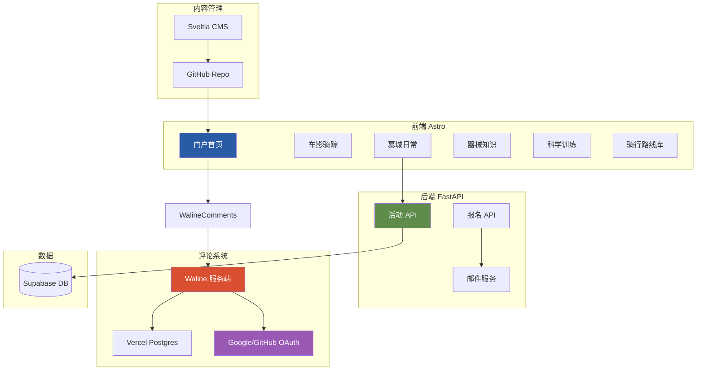

# ACC ClubHub 架构重建总纲

> **版本**: 1.0
> **创建日期**: 2026年1月27日
> **项目**: ACC (Across Cycling Club Munich) 门户网站
> **状态**: 待实施

---

## 第一部分：重建动机

### 1.1 原架构问题诊断

**原技术栈**: Quarto

| 问题维度               | 具体表现                                                   |
| ---------------------- | ---------------------------------------------------------- |
| **工具定位错配** | Quarto 为技术文档设计，非动态门户                          |
| **CSS 适配困难** | Bootstrap + Quarto 主题优先级高，覆盖需大量 `!important` |
| **交互能力有限** | 静态生成，表单/登录需外部服务                              |
| **设计自由度低** | 无法实现蓝骑士设计系统的倾斜、手绘效果                     |

### 1.2 目标架构


```mermaid
graph TB
    subgraph "前端 Astro"
        A[门户首页]
        B[车影骑踪]
        C[慕城日常]
        D[器械知识]
        E[科学训练]
        F[骑行路线库]
    end

    subgraph "内容管理"
        G[Sveltia CMS]
        H[GitHub Repo]
    end

    subgraph "后端 FastAPI"
        I[活动 API]
        J[报名 API]
        K[邮件服务]
    end

    subgraph "评论系统"
        L[Waline 服务端]
        M[Vercel Postgres]
        N[Google/GitHub OAuth]
    end

    subgraph "数据"
        O[(Supabase DB)]
    end

    A --> WalineComments
    C --> I --> O
    G --> H --> A
    J --> K
    WalineComments --> L
    L --> M
    L --> N

    style A fill:#2A5CA6,color:white
    style I fill:#5F8C4A,color:white
    style L fill:#D94F30,color:white
    style N fill:#9B59B6,color:white
```

---

## 第二部分：内容板块映射

基于 [ACC_2026焕新计划_企划书.md](file:///d:/my_projects/acc_clubhub/docs/ACC_2026%E7%84%95%E6%96%B0%E8%AE%A1%E5%88%92_%E4%BC%81%E5%88%92%E4%B9%A6.md) 的五大板块：

| 内容板块                  | 路由                    | 功能描述                             | 技术实现                    |
| ------------------------- | ----------------------- | ------------------------------------ | --------------------------- |
| **🎬 车影骑踪**     | `/media`              | 影像资料、骑友访谈、翻山越岭记录     | Decap CMS + VideoEmbed 组件 |
| **🚴 慕城日常**     | `/events`             | Social Ride、Training Day、活动报名  | FastAPI + 报名表单          |
| **🔧 器械知识**     | `/knowledge/gear`     | 购车指南、维修 Workshop、新品解读    | Decap CMS + 成员贡献        |
| **📊 科学训练**     | `/knowledge/training` | 训练方法论、安全科普                 | Decap CMS + 成员贡献        |
| **🗺️ 骑行路线库** | `/routes`             | 可搜索路线数据库、Strava/Komoot 链接 | Fuse.js 搜索 + CMS          |

### 页面结构

```
/                          # 首页 (中央导航 Hub)
├── /events                # 慕城日常 - 活动列表
│   └── /events/[id]       # 活动详情 + 报名
├── /media                 # 车影骑踪 - 影像库
│   └── /media/[slug]      # 影像/访谈详情
├── /knowledge             # 知识中心
│   ├── /knowledge/gear    # 器械知识
│   └── /knowledge/training # 科学训练
├── /routes                # 骑行路线库 (带搜索)
│   └── /routes/[slug]     # 路线详情
├── /about                 # 关于 ACC
└── /admin                 # Decap CMS 后台
```

---

## 第三部分：技术栈详解

### 3.1 前端: Astro

| 选择理由                            |
| ----------------------------------- |
| 静态优先，SEO 友好                  |
| 原生支持 Markdown/MDX               |
| Islands Architecture — 按需加载 JS |
| 100% 控制 HTML/CSS 输出             |
| 内置 i18n 多语言路由                |

### 3.2 后端: FastAPI

```python
# 核心 API 端点
POST /api/auth/login          # Supabase JWT 验证
GET  /api/events              # 活动列表
POST /api/events              # 创建活动 (admin)
POST /api/events/{id}/rsvp    # 活动报名
GET  /api/events/{id}/rsvps   # 报名列表 (admin)
```

### 3.3 认证: Supabase Auth

- Google OAuth ✅
- GitHub OAuth ✅
- Email/Password ✅
- 免费 50,000 MAU

### 3.4 内容管理: Decap CMS + 成员贡献

- 可视化编辑器
- GitHub 存储
- 无需服务器

> [!IMPORTANT]
> **成员内容贡献流程** (器械知识 / 科学训练):
>
> 1. 管理员在 GitHub 仓库 Settings → Collaborators 添加成员 GitHub 账号
> 2. 成员访问 `/admin` 并通过 GitHub OAuth 登录
> 3. 在可视化编辑器中撰写文章
> 4. 点击「发布」→ 自动提交到 GitHub → 网站更新

> [!NOTE]
> **两套独立登录系统**:
>
> | 系统          | 入口       | 用途           | 对象                      |
> | ------------- | ---------- | -------------- | ------------------------- |
> | Supabase Auth | 网站前台   | 活动报名、评论 | 所有访客                  |
> | Decap CMS     | `/admin` | 撰写/发布文章  | GitHub 仓库 Collaborators |

### 3.5 邮件: Resend

- 免费 3,000 封/月
- 开发者友好 API
- 良好送达率

---

## 第四部分：实施计划 (基于 Iterative Plan)

> **状态更新**: 截至 2026-02-10，Layer 1-3 已完成，Phase 4.1 (搜索与筛选) 已完成。

### 4.1 实施分层概览

| 层次                    | 描述                                            | 状态        | 完成日期   | 关键技术                               |
| ----------------------- | ----------------------------------------------- | ----------- | ---------- | -------------------------------------- |
| **Layer 1: 骨架** | 基础 Astro 项目结构、路由规划、布局组件         | ✅ 已完成   | 2026-01-2X | Astro, Components                      |
| **Layer 2: 样式** | 迁移 "蓝骑士" 设计系统，实现 CSS 变量与组件样式 | ✅ 已完成   | 2026-01-2X | CSS Variables, Blaue Reiter V3         |
| **Layer 3: 内容** | 搭建 CMS、定义内容集合、实现 i18n 动态渲染      | ✅ 已完成   | 2026-01-29 | Sveltia CMS, Content Collections, i18n |
| **Layer 4: 功能** | 搜索、评论、活动报名、认证                      | 🚧 部分完成 | -          | Waline, Supabase, FastAPI              |

### 4.2 Layer 4 详细进度

| Phase         | 功能                | 状态      | 完成日期   | 详细方案                                                                 |
| ------------- | ------------------- | --------- | ---------- | ------------------------------------------------------------------------ |
| **4.1** | 搜索与筛选系统      | ✅ 完成   | 2026-02-10 | [`phase_4_1_detailed_plan.md`](./rebuild_plan/phase_4_1_detailed_plan.md) |
| **4.2** | Waline 评论系统     | 📋 计划中 | -          | [`phase_4_2_waline_plan.md`](./rebuild_plan/phase_4_2_waline_plan.md)     |
| **4.3** | 活动报名 (Events)   | 📋 计划中 | -          | -                                                                        |
| **4.4** | 认证系统 (Supabase) | 📋 计划中 | -          | -                                                                        |

#### Phase 4.1: 搜索与筛选 — ✅ 已完成

**功能特性**:

- ✅ Fuse.js 加权模糊搜索 (标题、描述、标签、分类)
- ✅ 多维度筛选 (事件类型、路线难度、器械分类等)
- ✅ URL 状态同步 (筛选条件保存在 URL 中)
- ✅ 多语言支持 (zh/en/de)
- ✅ 响应式瀑布流布局

**技术实现**:

- `frontend/src/lib/search/fuseConfig.ts` — Fuse.js 配置
- `frontend/src/lib/filter/` — 筛选状态管理、工具函数
- `frontend/src/components/filter/` — FilterPanel 等组件
- `frontend/src/pages/api/search-index.[lang].json.ts` — 搜索索引 API

#### Phase 4.2: Waline 评论系统 — 📋 计划中

**目标**: 从 Giscus 迁移到 Waline，支持 Google/GitHub/访客评论

**当前状态**: Giscus 已集成 (仅 GitHub 登录)

**待实施**:

- 部署 Waline 服务端 (Vercel Serverless)
- 创建 Vercel Postgres 数据库
- 配置 Google/GitHub OAuth
- 创建 `WalineComments.astro` 组件
- 替换现有 Giscus 组件

#### Phase 4.3: 活动报名 (Events) — 📋 计划中

**目标**: 实现内部报名系统 + 邮件通知

**当前状态**: 静态页面已实现，仅支持外部报名链接

**已实现**:

- ✅ 活动列表页 (`EventsPage.tsx`) + 筛选功能
- ✅ 活动详情页 (`events/[slug].astro`)
- ✅ 外部报名链接按钮 (`registrationLink` 字段)

**待实施**:

- ❌ FastAPI 后端 API (`events.py`, `rsvp.py`)
- ❌ Supabase 数据库 (RSVP 记录)
- ❌ Resend 邮件通知服务
- ❌ 前端报名表单组件

#### Phase 4.4: 认证系统 — 📋 计划中

**目标**: 基于 Supabase 的用户注册/登录

**待实施**:

- ❌ Supabase Auth 配置 (Google/GitHub/Email)
- ❌ 前端 Auth 状态管理 (`lib/auth.ts`)
- ❌ 登录/注册 UI 组件
- ❌ 用户权限管理 (普通用户/管理员)

---

### 4.3 当前文件结构 (Layer 4 部分完成态)

```
acc_clubhub/
├── frontend/
│   ├── public/
│   │   ├── admin/
│   │   │   ├── index.html            # Sveltia CMS 入口
│   │   │   └── config.yml            # CMS 配置 (GitHub OAuth)
│   │   └── images/
│   ├── src/
│   │   ├── content.config.ts         # 内容集合定义 (Zod Schema)
│   │   ├── content/                  # Markdown 内容文件
│   │   │   ├── media/{zh,en,de}/*.md
│   │   │   ├── routes/{zh,en,de}/*.md
│   │   │   ├── gear/{zh,en,de}/*.md
│   │   │   ├── training/{zh,en,de}/*.md
│   │   │   └── events/.gitkeep       # 暂无内容
│   │   ├── components/
│   │   │   ├── filter/               # ✅ Phase 4.1: 筛选组件
│   │   │   │   ├── FilterPanel.tsx
│   │   │   │   ├── FilterCheckbox.tsx
│   │   │   │   └── FilterRange.tsx
│   │   │   ├── ui/                   # ✅ Phase 4.1: MasonryGrid, MasonryCard
│   │   │   ├── content/              # ✅ Phase 4.1: *Page.tsx (RoutesPage, etc.)
│   │   │   ├── Header.astro
│   │   │   ├── Footer.astro
│   │   │   ├── GiscusComments.astro  # ⚠️ 待迁移到 Waline
│   │   │   └── ...
│   │   ├── lib/
│   │   │   ├── i18n.ts               # 多语言工具
│   │   │   ├── search/               # ✅ Phase 4.1: Fuse.js 配置
│   │   │   │   └── fuseConfig.ts
│   │   │   └── filter/               # ✅ Phase 4.1: 筛选逻辑
│   │   │       ├── useFilterState.ts
│   │   │       ├── filterUtils.ts
│   │   │       ├── filterConfig.ts
│   │   │       └── facetUtils.ts
│   │   ├── layouts/
│   │   │   ├── BaseLayout.astro
│   │   │   └── ArticleLayout.astro
│   │   ├── pages/
│   │   │   ├── api/                  # ✅ Phase 4.1: 搜索索引 API
│   │   │   │   └── search-index.[lang].json.ts
│   │   │   └── [lang]/               # 动态多语言路由
│   │   │       ├── index.astro
│   │   │       ├── media/
│   │   │       │   ├── index.astro
│   │   │       │   └── [slug].astro
│   │   │       ├── knowledge/
│   │   │       │   ├── gear.astro
│   │   │       │   │   └── [slug].astro
│   │   │       │   └── training.astro
│   │   │       │       └── [slug].astro
│   │   │       ├── routes/
│   │   │       │   ├── index.astro
│   │   │       │   └── [slug].astro
│   │   │       └── events/
│   │   │           ├── index.astro
│   │   │           └── [slug].astro   # ⚠️ 仅静态页面
│   │   └── styles/                   # Blaue Reiter V3 样式
│   │       ├── variables.css
│   │       └── global.css
│   └── astro.config.mjs             # i18n + Preact + Vercel 配置
├── backend/                          # 📋 Layer 4.3: 待实施
│   ├── app.py                        # FastAPI 主应用 (空)
│   └── models.py                     # 数据模型定义
└── docs/
    └── rebuild_plan/
        ├── phase_4_1_detailed_plan.md    # ✅ 完成
        ├── phase_4_2_waline_plan.md      # 📋 计划中
        └── ...
```

**文件结构说明**:

- ✅ 已实现的 Phase 4.1 功能标记为 `✅ Phase 4.1`
- ⚠️ 部分实现的标记为 `⚠️`
- 📋 待实施的标记为 `📋`

---

## 第五部分：验证清单 (已更新)

| 阶段                | 验证项                                  | 状态    |
| ------------------- | --------------------------------------- | ------- |
| **Layer 1**   | 网站骨架搭建，页面路由互通              | ✅ PASS |
| **Layer 2**   | 蓝骑士设计风格落地，响应式适配          | ✅ PASS |
| **Layer 3**   | CMS 后台可访问，支持 GitHub 登录        | ✅ PASS |
| **Layer 3**   | 多语言 (zh/en/de) 内容发布与动态渲染    | ✅ PASS |
| **Layer 3**   | CI/CD 流水线 (Vitest + Playwright)      | ✅ PASS |
| **Phase 4.1** | 搜索与筛选系统 (Fuse.js + Filter)       | ✅ PASS |
| **Phase 4.2** | Waline 评论系统 (Google/GitHub/访客)    | 📋 TODO |
| **Phase 4.3** | 活动创建与报名流程 (FastAPI + Supabase) | 📋 TODO |
| **Phase 4.4** | Supabase 认证 (Google/GitHub/Email)     | 📋 TODO |

---

## 附录

### A. 相关文档

| 文档            | 路径                                                                                                                                           |
| --------------- | ---------------------------------------------------------------------------------------------------------------------------------------------- |
| ACC 2026 企划书 | [ACC_2026焕新计划_企划书.md](file:///d:/my_projects/acc_clubhub/docs/ACC_2026%E7%84%95%E6%96%B0%E8%AE%A1%E5%88%92_%E4%BC%81%E5%88%92%E4%B9%A6.md) |
| 蓝骑士设计指南  | [atomic_guide.md](file:///d:/my_projects/acc_clubhub/assets/styles/atomic_guide/atomic_guide.md)                                                  |
| 现有 CSS        | [blaue_reiter.css](file:///d:/my_projects/acc_clubhub/assets/styles/blaue_reiter.css)                                                             |
| 现有后端模型    | [backend/models.py](file:///d:/my_projects/acc_clubhub/backend/models.py)                                                                         |

### B. 外部服务

| 服务                  | 用途                   | 注册链接      | 状态        |
| --------------------- | ---------------------- | ------------- | ----------- |
| **Vercel**      | 前端部署 + Postgres    | vercel.com    | ✅ 使用中   |
| **Sveltia CMS** | 内容管理               | sveltia.cms   | ✅ 使用中   |
| **Waline**      | 评论系统 (计划中)      | waline.js.org | 📋 待部署   |
| **Supabase**    | 认证 + 数据库 (计划中) | supabase.com  | 📋 待配置   |
| **Resend**      | 邮件发送 (计划中)      | resend.com    | 📋 待配置   |
| **Railway**     | 后端部署 (可选)        | railway.app   | 📋 备选方案 |

### C. 决策记录

| 日期       | 决策             | 理由                                            |
| ---------- | ---------------- | ----------------------------------------------- |
| 2026-01-27 | 放弃 Quarto      | 设计自由度不足，无法支持交互功能                |
| 2026-01-27 | 不复用 REMS 前端 | 需要统一设计风格，避免跳转                      |
| 2026-01-27 | 选择 Astro       | 静态优先、设计自由、i18n 支持                   |
| 2026-01-27 | 选择 Supabase    | Google/GitHub OAuth，免费额度大                 |
| 2026-02-10 | 选择 Waline 评论 | 支持 Google/GitHub/访客，Vercel Postgres 易迁移 |
