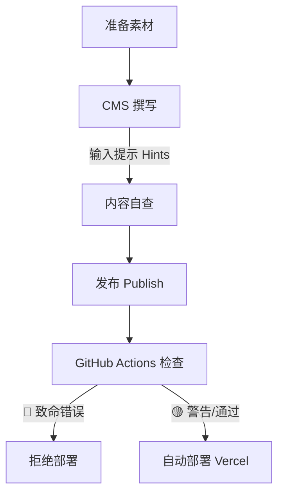

# ACC ClubHub 内容治理与架构总纲

> **目标**: 建立标准化的内容生产、管理和维护规范，确保网站长期健康运行。
> **适用对象**: 内容贡献者、开发者、管理员
> **生效日期**: 2026-01-29

---

## 1. 命名规范 (Naming Conventions)

混乱的文件名会导致 404 错误、引用困难及 SEO 降级。所有文件必须遵循以下规则：

### 1.1 通用规则

* **全小写英文**: 禁止使用中文、大写字母。
* **连字符分隔**: 使用 `-` (kebab-case) 代替空格或下划线。
* **无特殊字符**: 禁止 `(`, `)`, `.`, `?` 等字符。

### 1.2 图片/资源文件 (Assets)

**存储路径**: `frontend/public/images/uploads/`

**命名格式**: `{板块}-{描述}-{序号/类型}.{ext}`

| 板块前缀   | 示例                          | 说明                         |
| ---------- | ----------------------------- | ---------------------------- |
| `media-` | `media-alps-2025-cover.jpg` | 影像/游记封面                |
| `gear-`  | `gear-tarmac-sl8-frame.jpg` | 器械相关                     |
| `train-` | `train-indoor-setup.jpg`    | 训练相关                     |
| `route-` | `route-isar-map.jpg`        | 路线地图/风景                |
| `event-` | `event-coffee-ride-01.jpg`  | 活动海报                     |
| `user-`  | `user-avatar-tom.jpg`       | 用户头像 (如 content author) |

> **❌ 错误示例**:
>
> * `买canyon 吧.jpg` (中文)
> * `DSC04622.jpg` (无意义)
> * `Regatta.png` (大写)
> * `Image (1).jpg` (特殊字符)

### 1.3 内容文件 (Markdown)

**自动生成**: CMS 通常会根据标题自动生成 slug，但建议手动检查。

**格式**: `{date}-{keyword}.md` 或 简短语义化短语

* `2026-01-29-alps-ride.md`
* `how-to-clean-chain.md`

---

## 2. 内容知识图谱 (Taxonomy)

为满足深度内容检索需求，我们在 CMS 中引入 **分级分类体系**。

### 2.1 🔧 器械知识 (Gear)

架构逻辑: **一级分类 (Category)** -> **二级分类 (Subcategory)**

| 一级分类 (Category)                        | 二级分类代码 (Subcategory) | 显示名称 | 说明                       |
| ------------------------------------------ | -------------------------- | -------- | -------------------------- |
| **单车选购与组装**` bike-build` | `frames`                 | 车架系统 | 爬坡、气动、瓜车、铁三     |
|                                            | `groupsets`              | 传动系统 | 变速套件、牙盘、飞轮、链条 |
|                                            | `brakes`                 | 刹车系统 | 碟刹、圈刹、来令片         |
|                                            | `wheels`                 | 轮组轮胎 | 碳轮、铝轮、真空胎、管胎   |
|                                            | `cockpit`                | 操控组件 | 车把、把立、把带、坐垫     |
| **电子与穿戴**` electronics`    | `power`                  | 功率计   | 盘爪、曲柄、脚踏功率计     |
|                                            | `hr-monitor`             | 心率设备 | 心率带、臂带               |
|                                            | `computer`               | 码表     | Garmin, Wahoo, Coros       |
|                                            | `indoor`                 | 骑行台   | 直驱、滚筒、配件           |
| **人身装备**` apparel`          | `helmet`                 | 头盔     | 气动、透气、MIPS           |
|                                            | `shoes`                  | 锁鞋     | 锁片、鞋底刚性             |
|                                            | `clothing`               | 骑行服   | 骑行裤、排汗衫、防风衣     |
| **维修保养**` maintenance`      | `tools`                  | 工具     | 扭力扳手、内六角           |
|                                            | `cleaning`               | 清洁     | 洗链器、蜡性/油性链条油    |

### 2.2 📊 科学训练 (Training)

| 分类 (Category)                      | 标签 (Tags) 示例                                                    | 说明               |
| ------------------------------------ | ------------------------------------------------------------------- | ------------------ |
| **体能训练**` physical`   | 耐力 (Endurance), 力量 (Strength), 爆发力 (Sprint), 爬坡 (Climbing) | 针对身体素质的训练 |
| **训练计划**` planning`   | 周期化 (Periodization), 恢复 (Recovery), 减量 (Tapering)            | 宏观训练安排       |
| **营养与健康**` wellness` | 科学膳食 (Nutrition), 补给 (Fueling), 伤病预防 (Injury Prev)        | 吃与练的结合       |
| **数据分析**` analytics`  | FTP, VO2max, TSS, 疲劳度 (Fatigue)                                  | 功率数据解读       |

### 2.3 🎬 车影骑踪 (Media Taxonomy)

本板块用于记录俱乐部的精彩瞬间，核心维度为 **形式 (Format)** 与 **内容 (Content)**。

#### 2.3.1 一级分类：形式 (Format Type)

| 代码 (Type)   | 显示名称           | 定义                           | 适用场景                 |
| ------------- | ------------------ | ------------------------------ | ------------------------ |
| `video`     | **影像作品** | 以视频为主，文字为辅的视觉作品 | 年度大片、赛事集锦、vlog |
| `interview` | **骑友访谈** | 深度图文访谈，聚焦人物故事     | 核心成员介绍、大神专访   |
| `adventure` | **翻山越岭** | 长篇图文游记，记录长途旅程     | 阿尔卑斯穿越、环岛骑行   |
| `gallery`   | **活动图集** | 纯图片瀑布流，记录周末活动     | 周末 Social Ride、咖啡骑 |

#### 2.3.2 二级标签 (Tags)

为内容打上多维度标签，便于交叉索引：

* **活动类型**: `social-ride` (休闲骑), `training-camp` (训练营), `race` (比赛), `coffee-ride` (咖啡骑)
* **地点**: `alps` (阿尔卑斯), `munich` (慕尼黑), `italy` (意大利), `mallorca` (马略卡)
* **年份**: `2025`, `2026`

---

### 2.4 🗺️ 骑行路线 (Route Taxonomy)

路线库是核心资产，通过多维度参数帮助成员筛选最适合的路线。

#### 2.4.1 核心属性 (Core Attributes)

每条路线必须包含以下结构化数据 (Frontmatter)：

* **Region (区域)**: 路线的主要地理位置
* **Distance (距离)**: 公里数 (km)
* **Elevation (爬升)**: 累计爬升 (m)
* **Difficulty (难度)**: 基于距离和爬升的综合评级

#### 2.4.2 区域分类标准 (Region Standards)

| 区域代码 (Region) | 显示名称                   | 范围定义                                               |
| ----------------- | -------------------------- | ------------------------------------------------------ |
| `munich-south`  | **慕尼黑南郊**       | 城市以南，阿尔卑斯山麓平原 (Grünwald, Wolfratshausen) |
| `munich-north`  | **慕尼黑北郊**       | 城市以北，平路为主 (Freising, Erding)                  |
| `alps-bavaria`  | **巴伐利亚阿尔卑斯** | 德国境内的山地路线 (Tegernsee, Schliersee, Sudelfeld)  |
| `alps-austria`  | **奥地利阿尔卑斯**   | 越境进入奥地利的路线 (Achensee, Innsbruck, Kühtai)    |
| `alps-italy`    | **意大利多洛米蒂**   | 经典 Dolomiti 及其周边 (Sella Ronda, Stelvio)          |
| `island-spain`  | **西班牙海岛**       | 马略卡 (Mallorca), 加纳利 (Canary Islands)             |

#### 2.4.3 难度评级矩阵 (Difficulty Matrix)

请严格依据以下标准选择难度：

| 难度 (Difficulty) | 距离 (km) | 爬升 (m)   | 典型路线示例                                  |
| ----------------- | --------- | ---------- | --------------------------------------------- |
| `easy` 🟢       | < 60km    | < 400m     | 只有平路咖啡骑，适合纯萌新                    |
| `medium` 🟡     | 60-100km  | 400-1000m  | 周末标准 Social Ride，有起伏但无大坡          |
| `hard` 🟠       | 100-150km | 1000-2000m | 挑战路线，涉及 Sudelfeld 等一级坡             |
| `expert` 🔴     | > 150km   | > 2000m    | 顶级挑战，如 Ötztaler 模拟线，多日赛单日强度 |

#### 2.4.4 路况标签 (Surface Tags)

* `tarmac`: 铺装路面 (适合纯公路)
* `gravel`: 碎石路面 (建议宽胎/瓜车)
* `mixed`: 混合路面

---

## 3. 资源质量标准 (Asset Framework)

### 3.1 图片标准 (Image Standards)

#### 3.1.1 为什么选择 WebP?

WebP 是由 Google 开发的新一代图片格式 (Modern Image Format)。

* **体积更小**: 同等画质下，体积通常比 JPG 小 25-34%，能显著节省流量。
* **加载更快**: 极大地提升网页打开速度（秒开的关键），尤其是在 4G/5G 移动网络下。
* **全能支持**: 它同时具备 JPG 的高压缩率和 PNG 的透明背景支持。

#### 3.1.2 如何转换格式? (Tools)

我们强烈建议在上传前将所有 PNG/JPG 图片转换为 WebP。

**推荐工具**:

1. **[Squoosh.app](https://squoosh.app/) (首选推荐)**

   * **介绍**: Google 官方出品的网页版压缩工具，免费、离线运行、无广告。
   * **操作**: 拖入图片 → 右下角 Select Format 选 **WebP** → 拖动 Quality 滑块 → 下载。
   * **优点**: 可以实时对比 "原图" vs "压缩图" 的画质差异，直观控制体积。
2. **批量处理 (Advanced)**

   * **Windows/Mac**: 推荐使用免费软件 [XnConvert](https://www.xnview.com/en/xnconvert/)，可一次拖入几十张图批量转为 WebP。

#### 3.1.3 尺寸与体积规范 (Specs)

* **格式优先级**: **WebP** (强烈推荐) > JPG (照片备选) > PNG (仅限透明图标/Logo)
* **尺寸限制**:
  * **全屏大图 (Cover)**: 宽度 **1920px**, 体积控制在 **300KB** 以内。
  * **文章插图 (Content)**: 宽度 **1200px**, 体积控制在 **150KB** 以内。
  * **缩略图 (Thumbnail)**: 宽度 **600px**, 体积控制在 **50KB** 以内。

### 3.2 视频标准

* **托管**: **禁止直接上传视频文件**到代码仓库。
* **平台**: 使用 YouTube (国际) 或 Bilibili (国内)。
* **嵌入**: 仅在 CMS 中填写视频链接 (URL)。

---

## 4. 自动化治理工作流 (Automated Governance Workflow)

为了解放创作力并减轻管理员负担，我们采用 **CI (持续集成)** 工具来自动把控内容质量。
**核心原则**: **非致命问题仅警告，不阻止发布**。

### 4.1 源头治理：CMS 交互引导 (UI Hints)

最好的管理是**让用户不犯错**。我们将直接在 CMS 输入界面提供实时引导：

1. **输入占位符 (Hint Text)**

   * 在 `config.yml` 中为关键字段配置 `hint` 属性。
   * *Example (标题)*: 标题字段下方显示 "建议格式：2025-01-阿尔卑斯骑行"。
   * *Example (图片)*: 图片上传框下方显示 "⚠️ 请在本地重命名为 `media-xxx.jpg` 后上传"。
2. **正则校验 (Pattern Enforcement)**

   * **文件名 (Slug)**: 强制开启校验 `pattern: ['^[a-z0-9-]+$', "文件名只能包含小写字母、数字和连字符"]`。
   * **效果**: 输入不规范时，发布按钮灰色，无法提交。
3. **资源自动归档 (Smart Asset Management)**

   * *挑战*: 静态 CMS 原生不支持“自动重命名上传文件”。
   * *对策*: 虽不能自动改名，但可配置 **集合级媒体文件夹 (Collection Media Folder)**。
   * *配置*: 将 `media` 集合的图片强制存入 `public/images/uploads/media/`，`gear` 存入 `public/images/uploads/gear/`。
   * *收益*: 即使文件名不带前缀，物理目录也已实现了完美的分类治理。

### 4.2 机器审核标准 (CI Checks)

如果仍然有“漏网之鱼”，CI 系统作为最后一道防线：

#### 🛑 Level 1: 致命错误 (Blocking)

* **Astro 构建失败**: 缺少必填字段 (如 `region`)。

#### ⚠️ Level 2: 优化建议 (Non-Blocking)

* **图片体积**: > 500KB。
* **双语缺失**: 提醒补充翻译。
* **命名规范**: 检查是否符合 kebab-case。

---

## 5. 架构调整行动项 (Action Items)

为支持上述架构，Phase 4 开发重点包含：

1. **CMS 配置升级 (`config.yml`)**:
   * **Hint 覆盖**: 为所有 Title, Image 字段添加详细的用户指引。
   * **Pattern 校验**: 锁死 Slug 命名规则。
   * **分类字段**: 为 Gear/Training 添加 `category`, `subcategory`。
   * **媒体分流**: 配置 `media_folder` 参数，实现 `uploads/media/`, `uploads/gear/` 自动物理隔离。
2. **开发 Content Linter**: 编写 GitHub Action 脚本用于图片体积检查。
3. **UI 升级**: 路线列表页支持多维度筛选。
