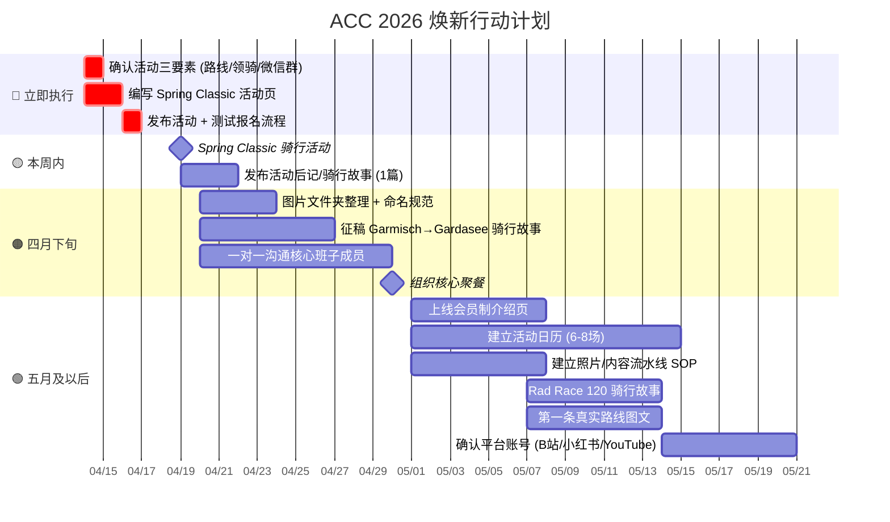
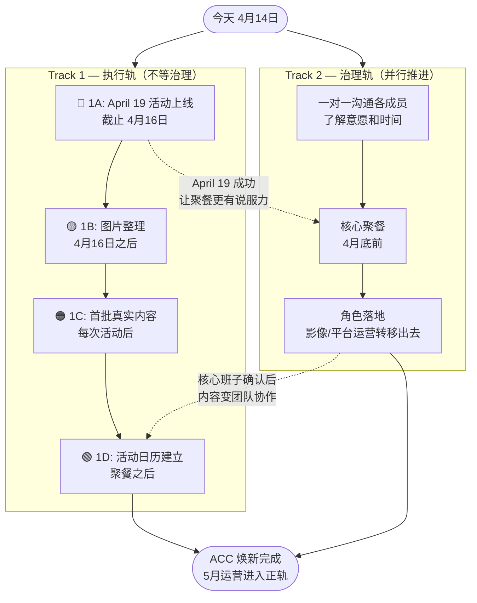
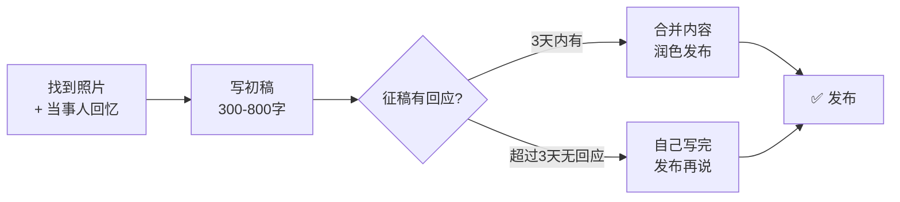
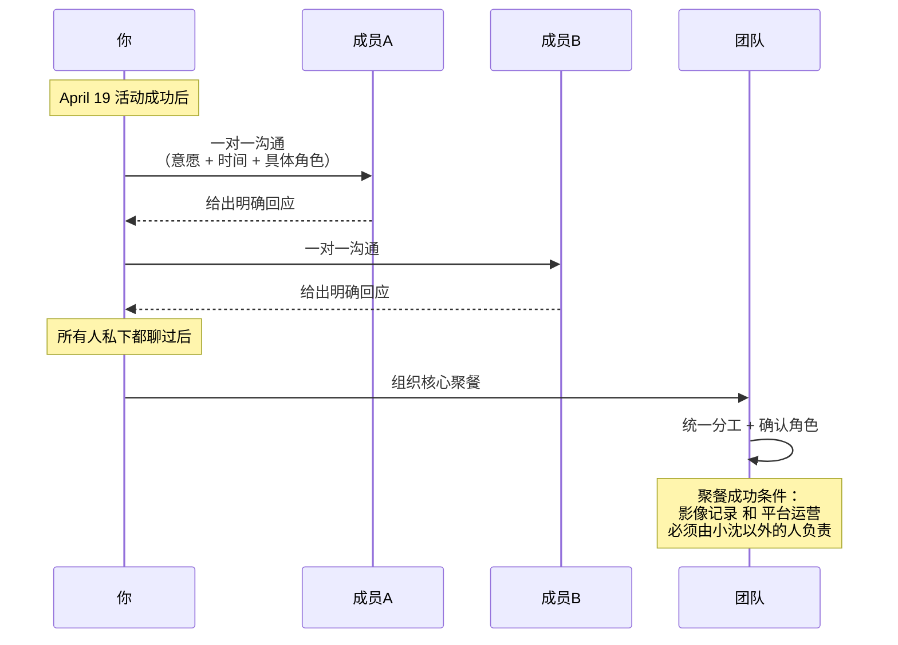
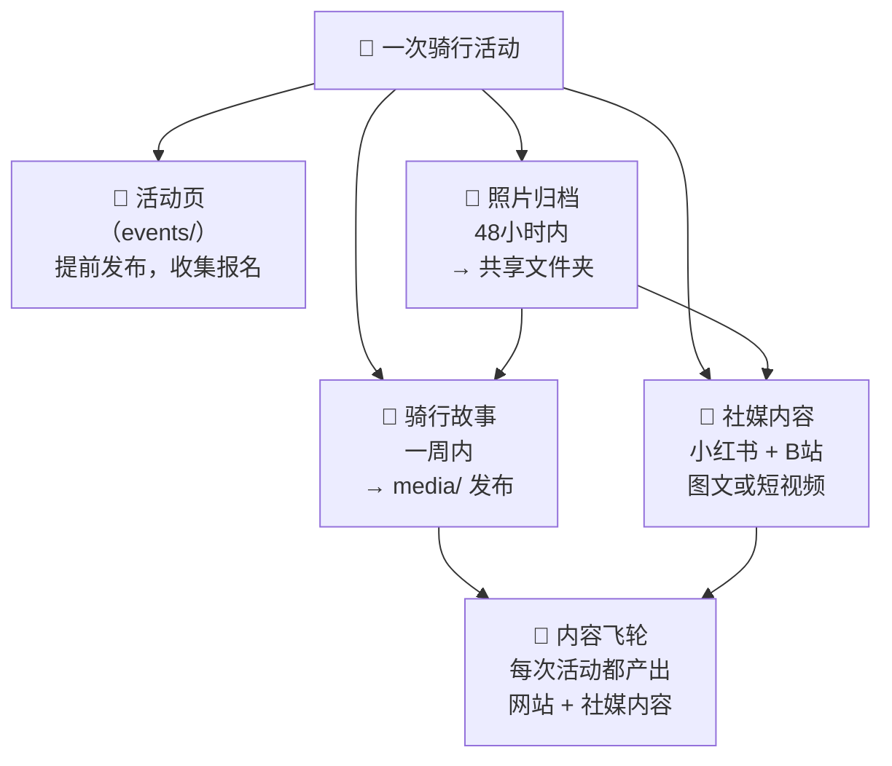
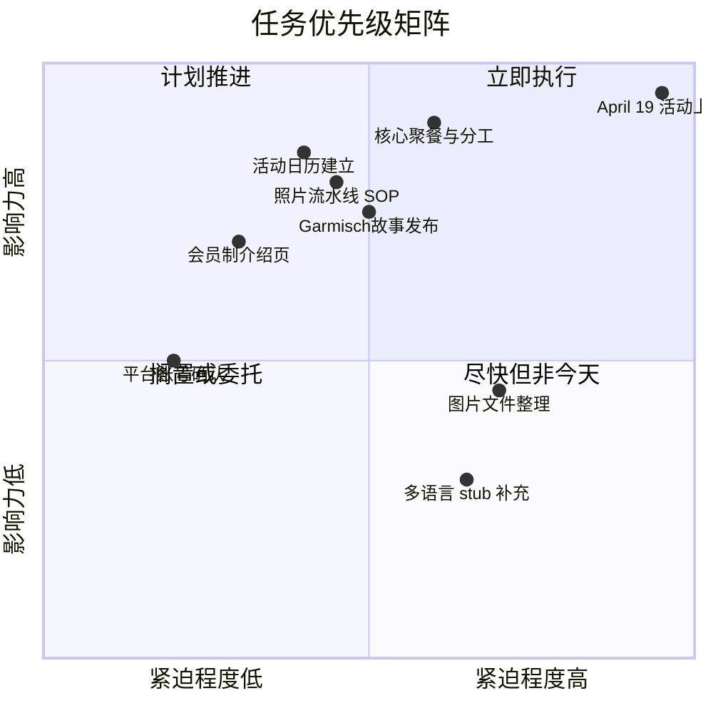

# ACC 2026 焕新行动计划

> 基于 [ACC_2026_relaunch_design.md](./ACC_2026_relaunch_design.md) 生成
> 日期：2026-04-14

---

## 核心逻辑

```
April 19 活动上线 → 证明焕新是真的 → 聚餐有底气 → 核心班子落地 → 内容变团队协作
```

在聚餐之前，**不要**独自写五篇内容。写内容是陷阱，激活团队才是杠杆。

---

## 总体时间线



---

## 双轨并行结构



---

## Track 1A — April 19 Season Opening

**截止：4月16日（两天内）**

### 前置依赖（今天解决，否则后面写不了）

| # | 依赖项 | 状态 | 负责人 |
|---|--------|------|--------|
| 1 | 确认路线（Komoot 或 Strava 链接） | ⬜ 待确认 | 你 |
| 2 | 确认领骑人姓名 | ⬜ 待确认 | 你 |
| 3 | 创建骑行微信群 + 截图二维码 | ⬜ 待确认 | 你 |

> 如果 4月15日前三项未全部确认，只发中文版，英/德版活动后再补。

### 执行清单

- [ ] 解决上方三项依赖
- [ ] 编写活动正文（中文）
  - 出发点：慕尼黑动物园
  - 路线：→ Ludwigshoehe → Schaeftlarn → 终点 cafe
  - 时间：9:00–12:00，约 50km，限额 50 人
  - 在活动页正文嵌入微信群二维码（比放邮件里更简单）
- [ ] 英/德版（时间允许则做，不允许则跳过）
- [ ] 本地跑一次测试报名，确认邮件回执正常
- [ ] 发布上线
- [ ] 推送到现有微信群

---

## Track 1B — 图片文件整理

**开始时间：4月16日之后（不得与 1A 抢时间）**

### 执行清单

- [ ] 命名规范：`{年份}-{活动slug}-{描述}.{扩展名}`
  - 示例：`2026-spring-classic-group.jpg`、`2024-rad-race-120-finish.jpg`
- [ ] 批量重命名 `frontend/public/images/uploads/` 下的所有文件
- [ ] 用 grep 找出所有 `.md` 文件中引用的旧文件名，逐一更新
- [ ] 将命名规范补充到 `docs/MAINTENANCE.md`

> 预计耗时 2-3 小时（含验证无死链）。

---

## Track 1C — 首批真实内容

**原则：一篇真实内容 > 五篇 AI 占位符。**
**顺序：有素材的先做，不要等完美。**



### 优先级排序

| 优先级 | 文件 | 素材现状 | 行动 |
|--------|------|----------|------|
| 🥇 第一 | `media/zh/garmisch-to-gardasee.md` | 传奇骑行，参与者记得 | 找照片 + 征稿，3天内无回应则自己写 |
| 🥈 第二 | `media/zh/rad-race-120_2025.md` | 真实比赛，有照片 | 同上 |
| 🥉 第三 | `routes/zh/` 其中一条 | 本地常骑路线 | 挑一条自己写真实路线笔记 |

---

## Track 1D — 活动日历建立

**开始时间：聚餐之后，核心班子确认领骑人后**

### 建议固定结构

| 类型 | 频率 | 说明 |
|------|------|------|
| 北线下班骑 | 每周二 | 固定路线，1-2 名领骑 |
| 南线下班骑（Isar方向） | 每周四 | 固定路线，1-2 名领骑 |
| 社交骑（~60km） | 隔周周末 | 轻松节奏，全级别 |
| 训练骑（~100km） | 隔周周末 | 与社交骑交替 |
| 多日骑游 | 每季度 | → 车影骑踪内容素材 |

### 执行清单

- [ ] 聚餐后确认每条路线的领骑人（有名字才发布，无名字填"ACC骑行组"）
- [ ] 在 CMS 创建未来 6-8 场活动
- [ ] 确保每场活动页面包含微信群二维码或报名入口

---

## Track 2 — 治理与核心班子



### 核心班子建议配置

| 角色 | 职责 | 建议人选 | 状态 |
|------|------|----------|------|
| 骑行活动组织 | 定期骑行安排 + 领骑 | 张怎样、ZDY | ⬜ 待确认 |
| 内容组织（骑行故事） | 媒体发文 + 征稿协调 | 小沈 | ✅ 已有 |
| 器械知识 | 维修 Workshop + 装备帖 | 林哥 | ⬜ 待确认 |
| 科学训练 | 训练内容 + 安全科普 | 马公梅、说话人B | ⬜ 待确认 |
| **影像记录** | **每次骑行拍照/视频** | **需转移出去** | ⬜ 必须换人 |
| **平台运营** | **小红书 + B站 发帖** | **需转移出去** | ⬜ 必须换人 |
| 网站运维 | 网站更新 + 技术问题 | 小沈 | ✅ 已有 |

> **聚餐的唯一成功标准**：影像记录和平台运营不再由小沈负责。否则只是换了个叫法，问题没变。

---

## 会员制（近期补充）

**不急，但上线后有实质价值。**

- [ ] 在网站增加会员制介绍页（FAQ 形式）
  - 费用：约 3€/月 或 39-49€/年
  - 权益：参与官方骑行活动时享有团体责任险
  - 挂靠：慕尼黑华人运动协会，完全非营利
- [ ] 在活动页加一行："ACC 正式会员在团骑中享有保险保障"
- [ ] 注册报名流程中增加会员升级引导（不强制，轻提示）

---

## 内容飞轮：一石多鸟



**飞轮转起来的前提**：每次重要骑行指定一名"影像官"，48小时内归档照片。没有这个 SOP，车影骑踪永远空着。

---

## 多语言策略（现在决定，以后不再纠结）

| 内容类型 | 中文 | 英文 | 德文 |
|----------|------|------|------|
| 活动页（events/） | ✅ 完整 | ✅ AI 辅助翻译 | ✅ AI 辅助翻译 |
| 骑行故事（media/） | ✅ 完整 | 简短 stub（"中文全文，英译即将上线"） | 简短 stub |
| 路线图文（routes/） | ✅ 完整 | 可选 | 可选 |
| 知识板块（knowledge/） | ✅ 完整 | 低优先级 | 低优先级 |

> 真实的中文内容 > 虚假的三语占位符。

---

## 全局优先级速查



---

*文档路径：`docs/core/ACC_2026_action_plan.md`*
*关联设计文档：`docs/core/ACC_2026_relaunch_design.md`*
*关联企划书：`docs/core/ACC_2026焕新计划_企划书.md`*
