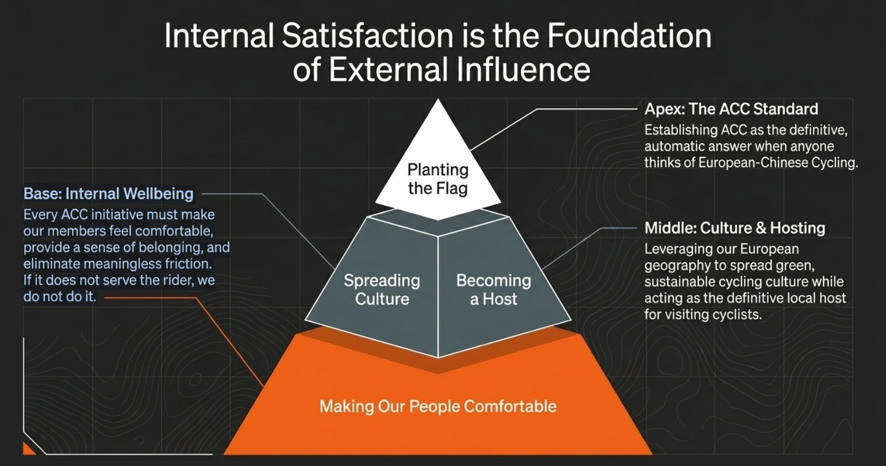

# Objecitve

  我要为ACC 2026.04.26 的第一次核心成员会议准备 slides。帮我写一个markdown 文本形式的 slides 文字稿。存在@docs/core 中,供我提供给 slides 专业 agent，生成会议所需的 slides。

# Background

## BG 1：

  目前俱乐部的处境： 嗯，目前我们 ACC 经历去年的沉寂之后，慢慢大家有了一起工作的迹象，但是还是都不够积极，就整个俱乐部有点名存实亡的感觉。因为，之前的模式是让领骑去带队什么的，但是那些奖励的机制、激励的体系都很不明了，所以大家也都缺乏热情。而且单车这个运动，它不像羽毛球那些之类的就是需要有场地，然后有固定的时间，然
  后大家需要去组团骑公路车或者说自行车这种运动是可以，它没有场地限制就比较自由，然后人都可以随便自发的。所以说有时候大家都觉得那我自己骑就行了，为什么还要去管那些集体去组织那个团旗，觉得那样是很，多余的东西。所以这个会议的一个关键就是要讲清楚我们这个俱乐部存在的意义，为什么我们 ACC
  要组织起来去组织团体，而且这种东西它意义不但在于就是我们讲那些形而上的抽象的东西，也在于一些实际的好处。就是有一些棋友或者说我们团队的成员，他们可能看还是要看实际的那些益处的。所以说，这个 slides
  的内容应该就不只是那些行政性的安排，而更多是那种团队的精神文化建设，然后还有使命感的那种意识的培养，这些东西也都很重要的。

## BG2

  项目的 @docs/core 中有ACC clubhub网站建设的纲要性文件供你参考。

## Raw Agenda:

  整个会议我打算以这样的步骤进行：

1. 一开始给大家简单总结一下 ACC 的现状，就是我们现在的经费只剩下了 70 块钱。而且，今年一个会员都没有，之前报名的十几个会员没有续费的啊。而且，我们之前的年份也没有去完成我们承诺的组织活动的指标。然后如果大家现在不努力建设的话，ACC 就死掉了。但我们现在决定重新把 ACC 发展起来. 这不是因为我们要去拯救一个空壳，什么，而是因为我们真的都热爱骑行，然后骑行改变了我们生活中很多东西，嗯，它给我们带来那种到处的自由，然后还带我们认识新的人。然后，而且他在我们生活的低谷里边，通过这种运动能够把我们给我们带来一种积极的心情。而且，人人们在，而且我们华人群体是在异国他乡，我们通过骑行认识了很多的友伴，然后在这儿也不感感到不再孤单。然后骑行的团体也都正在不断壮大.我们在路上遇到的是一个去是一个个穿骑行服的骑友们，但是其实他们背后又是非常鲜活的一个个个体，大家都有不同的，就是不一多种多样的爱好，然后还有能力，还有就是我们通过骑行也可以认识到很多有趣的人。然后如果我们单单只是出去骑车的话，其实背后就失去了很多那样挖掘更深刻的东西的机会，但是我们通过组建ACC这个团体，把大家更紧密地连接在一起。就是让给我们慕尼黑的骑行伙伴们一个家的感觉，然后也给我们自己一个建设一个家的感觉，让我们在这个骑行的过程中，它不再只是一个身体上的锻炼，而会增加出来很多精神上的滋养的东西。而且他我们如果把ACC这一整个巨行俱乐部打造起来，做成一个IP，然后把它推广起来的话，它也会给我们带来很实实在在的一些经济上的好处。就比如说，如果我们把这个俱乐部推推广起来，我们有了好的收入，那么我们今后自己的骑行，我们可能出去骑车，我们就有了一些餐补,我们的俱乐部的盈利也都可以放在我们俱乐部的比赛之中。然后我们通过俱乐部，这就是我们通过把众多棋友们组织起来，也包括我们ACC更的PRO们，大家的这些好的骑手们组织起来，去创造一个这样的有影响力的IP的时候，我们也可以拉到很多赞助。然后我们可能有自行车的配件呀，然后也有一些参赛的补贴，还有可能骑行服的这些补助等等，我们都可以去获得之后的反馈就是我们如果通过个人去提车，我们永远达不到PRO的水准，不可能去靠这些去赚钱怎么怎么样，但是我们有爱好，我们可以把这个爱好发展为我们给我们自身带来更多增益的事情。嗯，就是比如说，我们可能再也不需要在自行车这个运动上投入那么多的巨额巨额的金钱等等，而是我们有了这个IP之后，我们就可以达到自给自足就比如说，我们可能甚至以后可以组织ACC c的大的团体活动，然后我们在外住宿hotel的钱钱，什么都可以通过活动的收入来cover。然后，另外，不只是这些金金钱上，就是还有我们这些核心的 ACC 成员当 ACC 成为一个 IP 的时候，我们 ACC 的一些个体，我们也成为这种 IP 的一员，我们也是某一种荣誉，然后我们把他们也可以加入到自己领英的 profile 里面，成为就是你你在管理 ACC 的经验，你在这里边参与那些团体组织，都会成为将今后软技能的加分项。而且我们的 network 的扩展也是大家实际能感受到的，就比如说我们认识了华为的的华华哥 Edward，然后还有我们的元哥是在宝马的。然后其实大家形形色色的这些都是我们内部人自己说，其实他都是切实的。嗯，给大家带来的好处，就是你的 network 不只是在工作中 network 爱好也会带来很重要的 network 支撑，而且这种 networking 比那种在工作里边简单的点头之交的要更深厚得多，大家都是一起骑车，一起去参加比赛的战友。
2. 在讲了 ACC c 的意义之后，我们就要进入切实的议题，就是来第一点去讲一下现在的网站建设情况。我们现在网站已经我已经搭好了架子，就相当于我把房子已经盖起来了，然后外墙简单地粉刷了，但我们房子内的内核都还是空的。我们的我们没有我们客厅卧室什么大家都是空的，我们客厅是展示给我们的客人的，我们有应该有很多 knowledge 的东西分享。然后我们有我们的路线库，我们也要去发布活动，在我们的家门口的花园去组织大家玩耍。然后我我们的卧室，我们自己的休息的地方也是空的，我们现在没有自己俱乐部的一些好的福利带给大家，但是我们今后想做这些，而这些装这些内部装修的活已经不是我一个人能干完的了。而且一个房子内部想要让大家住起来都温馨，需要大家共同参与建设，给出自己的那种爱好喜好想法，这样我们才能把 ACC 做成一个真正。嗯，有爱的大家庭，让大家在骑行中不仅是感觉到身体的锻炼，而且是感觉到切实的那种，有一些精神的支撑，我们每一次 ACC 的人聚在一起，就像回家一样那种感觉。

3. 然后就是要讲更具体的事项，

   a). 财政，会费和激励：为了能达到我们最直接的就是切实的经济利益给大家带来的好处，我们可以就首先谈论收入这件事情。收入是由我们的会员会费的收入，然后再加上我们未来可能一些周边售卖的收入所共同决定的。我们会有一个俱乐部收入目标，激励计划，以及预算情况的讨论。还有就是，我们现在的会费太高了，我们要讨论把它去降级。具体参考下方 Appendix: ACC 2026 年度财务预算与运营激励评估报告

   b) 为了达到财政收入，扩大/保持 ACC 影响力以及对会员的承诺，我们需要满足的团骑活动安排： 我们每周可能有 3 个 ride （2 Afterwork （AW）， 1 weekend) 呃要去组织（2 AW = 1 north + 1 south, 1 weekend ride），然后一年有 6 个月可以组织 ride 嗯，每周有 3 个，一个月4.2 周, 4.2×6 约等于 25 周，乘以3 等于 75 个 ride。然后南边计划的领骑是，嗯，Ronie, wjs, szk, mgm, (Lin); 北边： zzy， yty， yuan，（Gen）； weekend：Xin，还有 AW 领骑

   c) 俱乐部组织职能划分： 组织管理活动，然后维持会员收入，会费制定，然后跟进会员管理，对就是会员管理，然后第三就是网站运维，未来我们可能还会涉及对外的赞助安排，以及我们的周边售卖的管理

   1) 活动组织官： ACC 团旗活动的协调安排的人员
   2) 会员及财政管理
   3) 网站运维
   4) 媒体运维
   5) 未来：赞助、周边售卖等

# Appendix：

# ACC 2026 年度财务预算与运营激励评估报告

**一、 背景与目标 (Context)**

随着 ACROSS Cycling Club (ACC) 的逐步壮大与官方网站的上线，为了进一步完善俱乐部的健康运营生态，管理组近期对俱乐部的会费标准和财务支出进行了全面梳理。

结合微信群内的最新投票结果（“学生 29欧 / 非学生 49欧”的档位获得了最高的支持率，占 42.9%），我们决定顺应大家的意愿，将会费标准由此前偏高的 59/79 欧，正式调整为更为科学和亲民的： **学生 29 欧/年，非学生 49 欧/年** 。

在扣除必须向上级华人体育协会缴纳的 10 欧综合管理费（包含 BLSV 综合协会费及意外伤害险等）后，每位新会员的平均净会费收入预计约为 29 欧（假设学生与非学生比例约为 1:1）。

本报告旨在测算我们在新会费标准下的运营资金需求，并确立基于筹款进度的“阶梯式资金分配策略”，以确保俱乐部的核心运转与长远发展。

**二、 年度核心支出模型推演**

为了维持俱乐部的高频活跃度与品牌曝光，我们设定了以下三大核心开支板块：

1. **领骑员 (Ride Leader) 基础餐补：1,125 欧**
   * **推演逻辑：** 慕尼黑适合骑行的季节按 6 个月计算。每个月按 4.2 周计，每周组织 3 次官方团骑，全年合计约 75 次 Ride。
   * **支出标准：** 我们为每次团骑拨出 15 欧的餐补预算（若单次团骑有 2 名 Ride Leader 共同带队，则平分这 15 欧，每人 7.5 欧）。
2. **社交媒体（小红书/Instagram）宣发激励金：130 欧**
   * **推演逻辑：** 鼓励核心成员在社媒发布活动帖并带上 `ACC - NAME` 的专属标签，同时鼓励所有会员积极互动（点赞/收藏）。
   * **支出标准：** 帖子每获得 1 个赞，发帖的核心成员获得 3 cent，参与互动的小伙伴获得 1 cent；帖子每获得 1 个收藏，发帖的核心成员获得 5 cent。官方账号运营者同理。
   * **预算预估：** 假设单贴平均获得 20 赞和 10 收藏，单贴激励金约为 1.30 欧。按全年 6 位核心成员总计发布约 100 篇帖子计算，总预算约为 130 欧。
3. **Rad Race 120 参赛报销及团建经费：1,100 欧**
   * **推演逻辑：** 作为俱乐部的年度高光时刻，我们计划为代表 ACC 参赛的 10 个 Rad Race 120 名额提供每人 110 欧的报名费报销。

**三、 结论：总资金需求与目标会员数**

综上，我们 2026 年度的 **总资金需求目标为 2,355 欧** 。

按每人 29 欧的平均净会费计算，我们需要招募约  **82 名会员** （2,355 / 29 ≈ 81.2）即可完全覆盖上述所有福利与报销计划。相比于此前的低收费方案，29/49欧的定价让我们的盈亏平衡点从 105 人下降到了 82 人，这在慕尼黑现有的骑行基数下是一个极具可行性的目标。

**四、 预算达标进度与阶梯式资金分配策略**

考虑到会员招募是一个循序渐进的过程，为了保障日常财务的绝对健康，我们将设定 **1,255 欧（即刚好覆盖上述领骑餐补 1125 欧与社媒激励 130 欧的总和）** 作为第一阶段财务分水岭，实行“保底+溢出”的阶梯分配机制：

* **第一梯队（基础运营保障线）：年度净资金 ≤ 1,255 欧**
  在此区间内，俱乐部的资金将**优先、且仅用于**满足 Ride Leader 的带车餐补以及社交媒体的宣发激励。
  * **动态折算原则：** 所有的餐补和激励金将根据当前资金池达成率（当前净资金 / 1,255）进行按比例折算。例如，如果我们当前筹集到的净资金只有目标的一半（约 627 欧），那么每次团骑的餐补标准将从 15 欧降至 7.5 欧；单贴的点赞/收藏激励金也同理按 50% 比例发放。
* **第二梯队（赛事与福利拓展线）：年度净资金 > 1,255 欧**
  当资金池突破 1,255 欧后：
  1. 前 1,255 欧将 100% 确保 Ride Leader 拿到全额的 15 欧/次餐补，以及核心成员拿到全额的社媒激励金。
  2. **超出 1,255 欧的所有资金** ，将全部自动转入「赛事与团建储备金」。这部分钱将专门用于我们去参加 Rad Race 120 的报名费报销，以及日后组织俱乐部大型团建活动（如集体聚餐、游玩、多日骑行住宿等）的统一开销。

通过这套机制，我们既能利用大家最认可的会费标准（29/49欧）来加速招新扩军，又能确保为俱乐部付出时间和精力的干事们得到稳定回报，最终在资金充裕时，将福利反哺给整个社区的所有会员。
