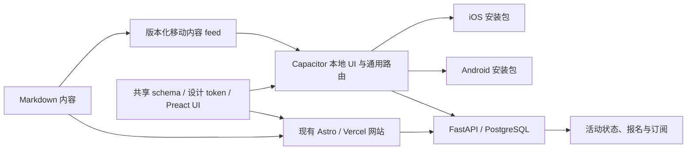

# ACC ClubHub 移动 App 安装包技术决策草案

状态：待产品决策
分支：`phase-13/mobile-app-packaging`
审计日期：2026-09-08

## 结论摘要

ACC ClubHub 可以继续以现有网页为唯一内容来源，但“直接用 WebView 打开
线上网站”不应作为正式上架方案。

如果目标只是让会员在 Android 和 iOS 桌面安装并获得接近 App 的体验，
优先把现有网站补成 PWA。这个方案改动最少，内容更新不需要经过应用商店
审核，但仍必须处理 Service Worker 的缓存更新和刷新提示。PWA 不会产生可
提交 App Store 的 IPA。

如果目标是同时进入 Apple App Store 和 Google Play，建议采用 Capacitor 8：

- 安装包内放置本地可执行 Web UI，不使用生产环境 `server.url`；
- Markdown 仍是唯一编辑来源，由网站构建生成版本化、只含数据的移动内容 feed；
- App 使用通用列表与详情壳读取 feed，因此新增内容不依赖预生成本地路由；
- 活动状态、报名和订阅继续通过现有 FastAPI HTTPS API 完成；
- 第一版加入离线收藏、活动深链接、系统分享和原生日历等骑行场景能力；
- Dashboard、管理员会话和代理 API 不进入安装包，继续在托管网站中使用。

这仍然是一款 Web-first App。相同版本的内容 feed 在网站与 App 中表达同一份
内容；网站 HTML 和 App UI 不承诺逐像素一致。原生层只负责安装、系统集成、
链接路由、离线兜底和商店发布。

首版不包含远程推送。远程推送需要设备 token、匿名订阅关系、APNs/FCM 发送端、
退订与数据保留策略，必须作为独立后端功能设计，不能仅靠安装 Capacitor 插件
完成。

## 为什么不直接包一层远程 WebView

技术上可以让原生容器打开 `https://www.across-cc.de`，而且每次网页发布都会
立即出现在 App 中。但正式产品不应依赖这条捷径：

- Apple App Review Guideline 4.2 要求 App 在功能、内容和 UI 上超越重新包装
  的网站；4.2.2 还明确限制以营销材料、网页剪报或链接集合为主的 App。
- Google Play 要求 App 具有足够、稳定且有意义的移动端功能，内容和功能过少
  的应用不允许发布。
- Capacitor 8 官方配置文档说明 `server.url` 用于 live reload，不应在生产环境
  使用；`allowNavigation` 也不是生产方案。
- 远程页面一旦不可用，App 就只剩空白页；导航、登录 Cookie、外链和回退键
  的行为也更难稳定控制。

因此，纯远程 WebView 仅可用于一次性原型验证，不进入正式发布分支。

## 当前仓库适配情况

现有前端并非一个可以原样复制进安装包的完整静态站点：

- Astro 配置为 `output: "server"` 并使用 Vercel adapter。
- 首页、About、Media、Knowledge、Routes、Membership 和多数内容详情页已经
  `prerender = true`，说明公开内容可以在构建时读取，但这些 HTML 不是完整的
  移动安装包。
- 活动列表和活动详情为 SSR。活动详情会在服务端获取取消、改期和参与者 token
  状态，因此当前构建产物中没有可直接打包的完整活动页面。
- Dashboard、登录、退订和 `/api/admin/*` 代理依赖 Vercel 服务端与 Cookie，
  不适合放入本地 Web 资源。
- 前端目前没有 Web App Manifest、Service Worker、移动安装图标或离线页。
- 公共报名 API 使用跨域请求，后端当前允许无凭证的公共 CORS。这只是需要在
  `capacitor://localhost` 和 `https://localhost` 真机验证的网络前提，不代表
  限流、重复提交、token 生命周期或未来设备注册接口已经适配完成。
- 管理员 Cookie 流程不应跨到 App 本地源。

## 推荐架构

### 1. 网页仍是源头

不复制三套中文、英文、德文内容。内容作者仍只修改现有 Markdown。网站部署
时额外生成经过 schema 校验的移动内容 feed，至少包含内容版本、语言、类型、
slug、正文、图片、链接、发布时间和删除标记。

feed 是数据，不包含脚本、可执行 HTML 或远程 UI。若正文需要 HTML，生成器必须
使用允许列表清理标签和属性。这样可以更新文章、路线和活动内容，而不会通过
远程数据改变已审核 App 的可执行功能。

### 2. Capacitor 打包本地 UI，而不是固定内容路由

`mobile/` 包含本地 Preact UI、通用列表页和通用 `/:lang/:type/:slug` 详情路由。
它从 feed 获取内容，因此 App 发布后新增的活动和文章不需要先存在于本地文件，
通知或深链接也能落到通用详情壳。未知、已删除或版本不兼容的 slug 必须显示
明确状态并允许前往托管网页。

网站现有 SSR 活动页保持不变。移动 UI 分别合并：

- 内容 feed 中的标题、正文、图片、地点和基础时间；
- FastAPI 中的取消、改期、人数、报名截止和报名可用状态。

FastAPI 不可用时必须 fail closed：标出最后更新时间，隐藏人数，不显示旧的
取消/改期状态为当前事实，并禁用报名提交。离线缓存可供阅读，但不能暗示活动
状态已经确认。

### 3. 原生壳只做系统能力

首版原生层不重新设计内容页，建议只承担以下职责：

- iOS Universal Links 与 Android App Links，将活动、路线和文章链接打开到
  App 内正确页面；
- 调用系统分享面板分享当前活动或路线；
- 将活动加入系统日历，明确展示时间、时区、地点和说明后再请求权限；
- 将用户主动收藏的活动或路线保存为可离线读取的数据；
- 处理状态栏、安全区、Android 返回键、启动画面、离线页和外部链接；
- Komoot、Strava、Google Maps、PDF 和非 ACC 表单按白名单交给系统或对应
  App 打开。

这些能力形成“找活动、离线收藏、加入日历、分享给骑友”的完整原生核心任务，
但只是一项降低最低功能审核风险的产品假设。提交前必须让审核人员无需管理员
账号即可完整体验，审核仍由商店最终决定，不能保证一定通过。

### 4. PWA 与 Capacitor 使用不同缓存策略

选择路径 A 或 B 时补齐 PWA：

- `manifest.webmanifest`：固定 `id`、名称、启动地址、`standalone` 展示模式、
  主题色，以及 192 和 512 像素图标；
- iOS touch icon、状态栏和主题 meta；
- Service Worker：版本化静态资源，公开 HTML Network First，离线页兜底；
- 不缓存 Dashboard、带 token 的 URL、报名 POST、管理员 API 或个人数据响应；
- 新版本激活时提示刷新，并在 Android Chrome 和 iOS Safari 真机验证安装、
  更新和缓存失效。

Capacitor native build 不注册或复制 PWA Service Worker。它的可执行 UI 随
安装包更新，内容数据使用带版本号的本地缓存。这样不会在原生资源更新之外再
叠加一层不受控的 Service Worker 缓存。

PWA 可以独立交付，也为 Android Trusted Web Activity 提供基础。如果只需要
Android 商店安装包，TWA 是比自制远程 WebView 更贴近“网页原样运行”的选择；
Digital Asset Links 只验证 App 与网站的归属，不保证满足商店最低功能要求。
TWA 不解决 iOS App Store 发布，因此不能独立满足双平台商店目标。

## 发布路径选择

### 路径 A：只需要手机安装，不要求商店

交付 PWA。Android 和 iOS 用户从浏览器添加到主屏幕。它最符合“完全就是
网页版内容”，维护成本最低。网页发布后无需重新审核安装包，但用户看到新版本
的时机仍受 Service Worker 激活和刷新策略影响。

### 路径 B：Android 商店 + iOS 主屏幕安装

PWA 加 Android TWA。Android 生成 AAB 并通过 Digital Asset Links 验证；
iOS 仍使用 PWA。该路径能较快提供 Android 商店入口，但两端分发体验不完全
一致。

### 路径 C：Apple App Store + Google Play

采用推荐的 Capacitor 本地 UI、远程内容 feed 和 FastAPI 实时状态方案，并加入
离线收藏、活动深链接、系统分享和日历。这是双商店目标下更稳妥的工程路径，
但需要原生签名、商店账号、真机测试、隐私声明和持续发布流程。

### 路径 D：只生成测试安装包

沿用路径 C 的架构，但先只产出 Android 内部测试包和 iOS TestFlight build，
不承诺公开上架。公开发布与测试分发的代码安全边界相同，不能用远程 WebView
作为临时架构后再直接提交商店。TestFlight 同样需要 Apple Developer、签名、
archive 和 App Store Connect；没有这些条件时只能交付 iOS Simulator build，
不能称为可安装的 iPhone 测试包。

## 内容、API 与旧版本兼容

- 移动内容 feed 使用稳定的 `v1` schema，并提供 `content_revision`、生成时间、
  最低支持 App 版本和 ETag。
- 每个活动必须有不可变的 `event_key`，当前值与 FastAPI 的 canonical `slug`
  相同。三种语言共享一个 `event_key`，本地化 URL slug 另存；构建在语言版本
  缺失、键不一致或后端同步 slug 不一致时失败。将来改 URL 时保留原键和别名。
- feed 负责本地化标题、正文、封面、路线和说明；FastAPI 负责活动日期、集合点、
  是否公开、活动类型、报名截止、容量、人数、取消与改期。两边冲突时运营 API
  优先，并记录可观测错误，不能静默合并。
- `v1` 内只做向后兼容的字段新增。破坏性变更发布新 schema，并在下架旧 schema
  前确认旧 App 的支持窗口。
- 通用详情路由先读取本地缓存，再验证 feed 中的最新记录。删除或紧急下架的内容
  通过 tombstone 失效，不能永久停留在离线收藏中。
- FastAPI 返回 schema 不兼容或低于最低版本时，App 显示升级提示，不猜测字段
  含义，也不允许继续提交报名。
- 可执行 UI、路由和业务规则只能通过商店安装包更新；远程 feed 只更新内容数据。

## 链接与权限边界

不能使用“同域内链都留在 App”这一简单规则。移动路由需要显式允许列表：

- App 内打开：三语公开首页、About、Events、Media、Knowledge、Routes、
  Membership、Partners、Privacy 和 Insurance。
- 系统浏览器打开：`/dashboard/*`、`/auth/*`、`/api/*`、退订、参与者管理 token、
  非 ACC 表单及无法安全解析的 URL。
- 对应的 AASA components 与 Android intent filters 尽量不捕获排除路由；网站
  Digital Asset Links 只证明域名归属。即使操作系统已将链接交给 App，运行时
  路由也必须再次拒绝，并避免把 token 写入日志、历史、崩溃报告或缓存。
- App 内报名和订阅是明确允许的 ACC 公共 API 操作，不属于“外部表单”；失败时
  不持久化个人字段，不自动重复提交。

首次启动语言按系统首选语言选择 zh、en 或 de，之后使用用户保存的选择。带语言
的深链接优先于本地选择；离线且没有历史选择时回退为中文。该规则需要与现有
网站语言选择器保持一致。

## 实施顺序

### 里程碑 0：确认产品与发布边界

- 选择路径 A、B、C 或 D。
- 确认是否只包含公开会员内容，默认不包含 Dashboard。
- 确认是否接受离线收藏、分享、日历和深链接作为原生能力。
- 确认 Apple Developer 与 Google Play Console 的账号主体、Bundle ID 和应用名。

### 选择 A：PWA

- 添加 Manifest、图标、安装 meta、Service Worker 和离线页。
- 修正安全区、键盘、横竖屏、外链和独立显示模式。
- 验证三语内容、报名、订阅、Waline、Komoot 和路线页。

### 选择 B：PWA 加 Android TWA

- 先完成路径 A。
- 添加 Web App 与 Android 包的 Digital Asset Links 双向配置。
- 生成 AAB，验证未通过域名关联时的浏览器回退和 Play 内部测试。

### 选择 C 或 D：内容 feed 与本地移动 UI

- 先定义并测试移动内容 `v1` schema、通用新内容路由和删除机制。
- 从现有 Markdown 构建经过清理的静态 JSON feed，并与网站部署一起发布。
- 新建顶层 `mobile/` Preact UI，复用设计 token 和可移植组件；不复制 Astro
  页面文件或注册 Service Worker。
- 合并内容 feed 与 FastAPI 实时状态，完成离线缓存、fail-closed 和版本不兼容
  流程。
- 添加路由允许/拒绝列表及构建检查，阻止私有页面、token、源映射、服务端代码
  和签名秘密进入安装包。

### 选择 C 或 D：Capacitor 原生项目

- 添加 `mobile/ios/`、`mobile/android/` 和 Capacitor 配置。
- 接入深链接、离线收藏、分享、日历、外链与离线错误处理。
- 生成调试 APK 和 iOS Simulator build，并完成 Android 与 iOS 真机回归。

### 选择 C 或使用 TestFlight 的 D：签名与测试分发

- 配置 Android keystore、AAB、App Links 和 Play 内部测试。
- 配置 iOS signing、Universal Links 和 TestFlight。

### 选择 C：商店资料与公开发布

- 补齐商店截图、隐私清单、审核说明、支持 URL 和数据安全表单。
- 通过内部测试后再提交正式审核。

远程推送不属于上述首版里程碑。如后续采用，先单独批准设备 token、匿名订阅、
APNs/FCM、发送触发、退订、换机、失败清理、防滥用和数据保留设计。

## 验收标准

- Android 与 iOS 从冷启动进入正确语言首页，无网络时显示可理解的离线状态。
- 三语内容 feed 与网站的同一份 Markdown 一致；新增活动可由通用路由打开，
  无需重新发布 App。
- 活动取消、改期和报名状态来自 API，不依赖安装包内旧数据作最终判断。
- 实时状态不可确认时显示最后更新时间并禁用报名，不把缓存状态当作当前事实。
- 报名和订阅成功、失败及重试行为与网页一致，不缓存个人信息。
- 允许路由留在 App；拒绝路由、PDF 和第三方服务使用正确的系统处理方式。
- 深链接、离线收藏、分享和日历在真机上通过权限拒绝、恢复及异常路径测试。
- Dashboard、管理员 API 代理、Cookie、参与者 token 和源映射均未进入安装包
  或本地缓存。
- 当前 App 与移动内容/API schema 不兼容时给出升级提示并停止危险操作。
- Android AAB 与 iOS archive 可重复构建，签名秘密不进入 Git。

## 仍需用户确认

1. 目标是主屏幕安装、测试分发，还是 Apple/Google 两个公开商店？
2. App 是否只面向普通会员，明确排除 Dashboard？
3. 是否接受离线收藏、系统分享、加入日历和深链接这些轻量原生能力？
4. 若选择 PWA，离线是否只显示提示；若选择 Capacitor，离线收藏需保留正文、
   图片还是仅活动摘要？
5. ACC 是否已经有 Apple Developer 和 Google Play Console 组织账号？
6. 内容 feed 的旧版本支持窗口和紧急下架时限应是多少？

## 官方依据

- [Apple App Review Guidelines](https://developer.apple.com/app-store/review/guidelines/)，
  重点为 2.1、2.5.2、2.5.6、4.2 和 4.2.2，访问于 2026-09-08。
- [Google Play: Functionality, Content, and User Experience](https://support.google.com/googleplay/android-developer/answer/9898783)，
  访问于 2026-09-08。
- [Capacitor 8 Configuration](https://capacitorjs.com/docs/config)，重点为
  `webDir`、`server.url` 和 `allowNavigation`，访问于 2026-09-08。
- [Capacitor workflow](https://capacitorjs.com/docs/basics/workflow)，说明构建、
  `cap sync` 与 AAB/APK/IPA 输出，访问于 2026-09-08。
- [Android Trusted Web Activities](https://developer.android.com/develop/ui/views/layout/webapps/trusted-web-activities)，
  访问于 2026-09-08。
- [Chrome installable manifest requirements](https://developer.chrome.com/docs/lighthouse/pwa/installable-manifest)，
  访问于 2026-09-08。
- [Apple notification permission guidance](https://developer.apple.com/documentation/usernotifications/asking-permission-to-use-notifications)，
  访问于 2026-09-08。
- [Android notification runtime permission](https://developer.android.com/develop/ui/compose/notifications/notification-permission)，
  访问于 2026-09-08。
