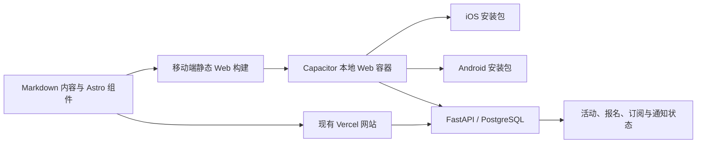

# ACC ClubHub 移动 App 安装包技术决策草案

状态：待产品决策  
分支：`phase-13/mobile-app-packaging`  
审计日期：2026-09-08

## 结论摘要

ACC ClubHub 可以继续以现有网页为唯一内容来源，但“直接用 WebView 打开
线上网站”不应作为正式上架方案。

如果目标只是让会员在 Android 和 iOS 桌面安装并获得接近 App 的体验，
优先把现有网站补成 PWA。这个方案改动最少、网页更新立即可见，也不需要
分别维护 Android 和 iOS 代码，但不会产生可提交 App Store 的 IPA。

如果目标是同时进入 Apple App Store 和 Google Play，建议采用 Capacitor 8：

- 安装包内放置经过构建的本地 Web UI，不使用生产环境 `server.url`；
- Markdown 内容和现有 Astro 组件仍是唯一内容与视觉来源；
- 活动状态、报名和订阅继续通过现有 FastAPI HTTPS API 完成；
- 第一版至少加入活动深链接、系统分享、原生日历和活动通知等骑行场景能力；
- Dashboard、管理员会话和代理 API 不进入安装包，继续在托管网站中使用。

这仍然是一款 Web-first App，用户看到的内容与网页版一致；原生层只负责安装、
系统集成、链接路由、离线兜底和商店发布。

## 为什么不直接包一层远程 WebView

技术上可以让原生容器打开 `https://www.across-cc.de`，而且每次网页发布都会
立即出现在 App 中。但正式产品不应依赖这条捷径：

- Apple App Review Guideline 4.2 要求 App 在功能、内容和 UI 上超越重新包装
  的网站；4.2.2 还明确限制以营销材料、网页剪报或链接集合为主的 App。
- Google Play 要求 App 具有足够、稳定且有意义的移动端功能，内容和功能过少
  的应用不允许发布。
- Capacitor 8 官方配置文档说明 `server.url` 用于 live reload，不应在生产环境
  使用；`allowNavigation` 也不是生产方案。
- 远程页面一旦不可用，App 就只剩空白页；导航、登录 Cookie、外链和回退键
  的行为也更难稳定控制。

因此，纯远程 WebView 仅可用于一次性原型验证，不进入正式发布分支。

## 当前仓库适配情况

现有前端并非一个可以原样复制进安装包的完整静态站点：

- Astro 配置为 `output: "server"` 并使用 Vercel adapter。
- 首页、About、Media、Knowledge、Routes、Membership 和多数内容详情页已经
  `prerender = true`，适合作为本地 Web 资源。
- 活动列表和活动详情为 SSR。活动详情会在服务端获取取消、改期和参与者 token
  状态，因此当前构建产物中没有可直接打包的完整活动页面。
- Dashboard、登录、退订和 `/api/admin/*` 代理依赖 Vercel 服务端与 Cookie，
  不适合放入本地 Web 资源。
- 前端目前没有 Web App Manifest、Service Worker、移动安装图标或离线页。
- 公共报名 API 使用跨域请求，后端当前允许无凭证的公共 CORS，因此移动端
  直接调用 FastAPI 具备基础条件；管理员 Cookie 流程不应跨到 App 本地源。

## 推荐架构

### 1. 网页仍是源头

不复制三套中文、英文、德文内容。移动构建读取同一组 Astro content
collections、组件、设计 token 和图片。内容作者仍只修改现有 Markdown。

### 2. 增加受控的移动静态构建

移动安装包只包含公开页面。为了让核心活动功能也能本地启动，需要先完成：

1. 将活动列表改为可预渲染页面。
2. 将活动详情的公开内容预渲染，页面加载后再从 FastAPI 获取取消、改期、人数
   和报名可用状态。
3. 将搜索索引明确生成为静态 JSON。
4. 参与者专属 token 链接若暂不改为客户端加载，则交给系统浏览器打开托管网页。
5. 构建后检查移动资源目录中不存在 Dashboard、鉴权端点、源映射和服务端代码。

Capacitor 的 `webDir` 指向这一受控构建目录。网页生产构建仍使用 Vercel
adapter，两种构建必须由独立命令生成，避免互相覆盖。

### 3. 原生壳只做系统能力

首版原生层不重新设计内容页，建议只承担以下职责：

- iOS Universal Links 与 Android App Links，将活动、路线和文章链接打开到
  App 内正确页面；
- 调用系统分享面板分享当前活动或路线；
- 将活动加入系统日历，明确展示时间、时区、地点和说明后再请求权限；
- 接收活动提醒、改期和取消通知，并深链接到对应活动；
- 处理状态栏、安全区、Android 返回键、启动画面、离线页和外部链接；
- Komoot、Strava、Google Maps、PDF 和表单按白名单交给系统或对应 App 打开。

这些能力不会改变网站内容，但会提供清晰的移动端价值，降低“重新包装网站”
的审核风险。审核仍由商店最终决定，不能保证一定通过。

### 4. PWA 是共同基础，不是重复工作

在原生安装包之前先补齐 PWA：

- `manifest.webmanifest`：固定 `id`、名称、启动地址、`standalone` 展示模式、
  主题色，以及 192 和 512 像素图标；
- iOS touch icon、状态栏和主题 meta；
- Service Worker：静态资源 Cache First、公开 HTML Network First、离线页兜底；
- 不缓存 Dashboard、带 token 的 URL、报名 POST、管理员 API 或个人数据响应；
- 在 Android Chrome 和 iOS Safari 的真实设备上验证安装、更新和缓存失效。

PWA 可以先交付给用户，也为 Android Trusted Web Activity 提供基础。如果只需要
Android 商店安装包，TWA 是比自制远程 WebView 更贴近“网页原样运行”的选择；
它使用 Digital Asset Links 验证 App 与网站属于同一主体。TWA 不解决 iOS
App Store 发布，因此不能独立满足双平台商店目标。

## 发布路径选择

### 路径 A：只需要手机安装，不要求商店

交付 PWA。Android 和 iOS 用户从浏览器添加到主屏幕。它最符合“完全就是
网页版内容”，维护成本最低，网页发布后无需重新审核安装包。

### 路径 B：Android 商店 + iOS 主屏幕安装

PWA 加 Android TWA。Android 生成 AAB 并通过 Digital Asset Links 验证；
iOS 仍使用 PWA。该路径能较快提供 Android 商店入口，但两端分发体验不完全
一致。

### 路径 C：Apple App Store + Google Play

采用推荐的 Capacitor 本地资源方案，并加入活动深链接、系统分享、日历和通知。
这是双商店目标下更稳妥的工程路径，但需要原生签名、商店账号、真机测试、
隐私声明和持续发布流程。

## 实施顺序

### 里程碑 0：确认产品与发布边界

- 选择路径 A、B 或 C。
- 确认是否只包含公开会员内容，默认不包含 Dashboard。
- 确认是否接受通知、分享、日历和深链接作为原生能力。
- 确认 Apple Developer 与 Google Play Console 的账号主体、Bundle ID 和应用名。

### 里程碑 1：PWA 与移动网页基线

- 添加 Manifest、图标、安装 meta、Service Worker 和离线页。
- 修正安全区、键盘、横竖屏、外链和独立显示模式。
- 验证三语内容、报名、订阅、Waline、Komoot 和路线页。

### 里程碑 2：公开页面可打包化

- 将活动公开页面改成预渲染加客户端实时状态。
- 静态化搜索索引，定义移动构建的页面允许列表。
- 添加构建检查，阻止私有页面、token URL 和服务端代码进入安装包。

### 里程碑 3：Capacitor 原生项目

- 新建顶层 `mobile/`，包含 `ios/`、`android/` 和 Capacitor 配置。
- 接入深链接、分享、日历、通知、外链与离线错误处理。
- 生成未签名调试 APK 和 iOS Simulator build，完成真机回归。

### 里程碑 4：签名与发布

- 配置 Android keystore、AAB、App Links 和 Play 内部测试。
- 配置 iOS signing、Universal Links、APNs 和 TestFlight。
- 补齐商店截图、隐私清单、审核说明、支持 URL 和数据安全表单。
- 通过内部测试后再提交正式审核。

## 验收标准

- Android 与 iOS 从冷启动进入正确语言首页，无网络时显示可理解的离线状态。
- 三语公开内容与同一提交构建的网页版一致。
- 活动取消、改期和报名状态来自 API，不依赖安装包内旧数据作最终判断。
- 报名和订阅成功、失败及重试行为与网页一致，不缓存个人信息。
- 内链留在 App；白名单外链、PDF 和第三方服务使用正确的系统处理方式。
- 深链接、分享、日历和通知在真机上通过权限拒绝、恢复及异常路径测试。
- Dashboard、管理员 API 代理、Cookie 和带参与者 token 的缓存均未进入安装包。
- Android AAB 与 iOS archive 可重复构建，签名秘密不进入 Git。

## 仍需用户确认

1. 目标是主屏幕安装、测试分发，还是 Apple/Google 两个公开商店？
2. App 是否只面向普通会员，明确排除 Dashboard？
3. 是否接受通知、系统分享、加入日历和深链接这些轻量原生能力？
4. 是否要求正文和图片离线可读，还是只需要一个离线提示页？
5. ACC 是否已经有 Apple Developer 和 Google Play Console 组织账号？

## 官方依据

- [Apple App Review Guidelines](https://developer.apple.com/app-store/review/guidelines/)，
  重点为 2.1、2.5.2、2.5.6、4.2 和 4.2.2，访问于 2026-09-08。
- [Google Play: Functionality, Content, and User Experience](https://support.google.com/googleplay/android-developer/answer/9898783)，
  访问于 2026-09-08。
- [Capacitor 8 Configuration](https://capacitorjs.com/docs/config)，重点为
  `webDir`、`server.url` 和 `allowNavigation`，访问于 2026-09-08。
- [Capacitor workflow](https://capacitorjs.com/docs/basics/workflow)，说明构建、
  `cap sync` 与 AAB/APK/IPA 输出，访问于 2026-09-08。
- [Android Trusted Web Activities](https://developer.android.com/develop/ui/views/layout/webapps/trusted-web-activities)，
  访问于 2026-09-08。
- [Chrome installable manifest requirements](https://developer.chrome.com/docs/lighthouse/pwa/installable-manifest)，
  访问于 2026-09-08。
- [Apple notification permission guidance](https://developer.apple.com/documentation/usernotifications/asking-permission-to-use-notifications)，
  访问于 2026-09-08。
- [Android notification runtime permission](https://developer.android.com/develop/ui/compose/notifications/notification-permission)，
  访问于 2026-09-08。
