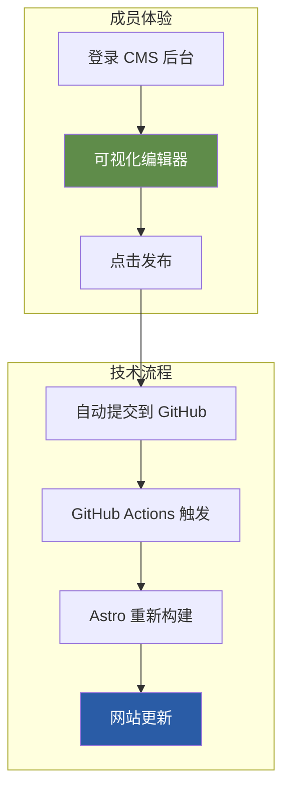
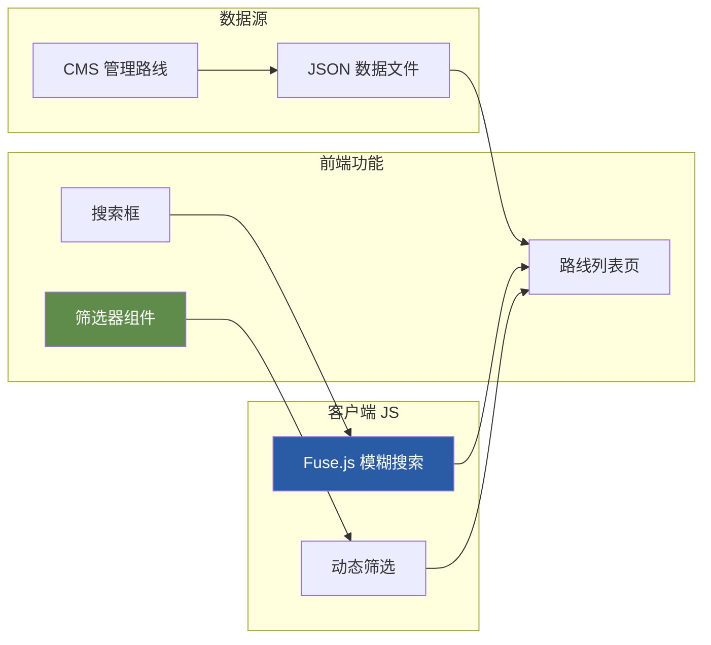
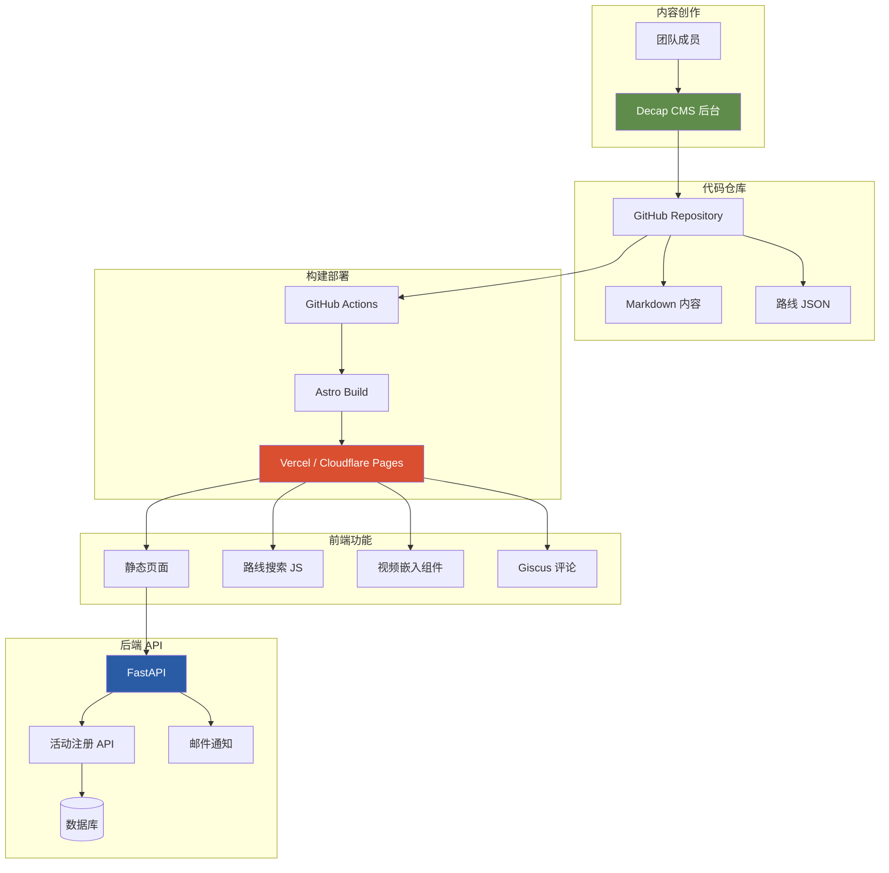
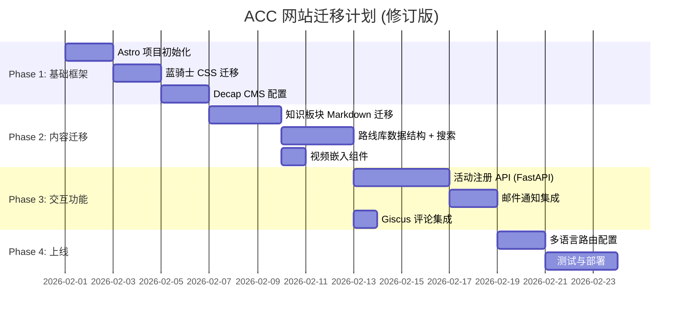

# ACC 门户网站架构诊断报告 v2

> **诊断日期**: 2026年1月27日 (更新)  
> **项目**: ACC (Across Cycling Club Munich) 俱乐部门户网站  
> **决策**: ✅ 放弃 Quarto，迁移至现代前端框架

---

## 📋 执行摘要

| 维度 | 结论 |
|------|------|
| **核心判断** | Quarto 不适合动态门户网站，确认迁移 |
| **推荐技术栈** | **Astro + Headless CMS + FastAPI** |
| **关键能力** | 成员内容贡献、活动注册、路线搜索 |

> [!IMPORTANT]
> **架构方向已确定**: 基于您的反馈，本报告聚焦于 **具体实现方案** 和 **技术选型细节**。

---

## 1. 需求澄清与实现方案

### 1.1 车影骑踪 — 视频嵌入方案

**您的需求**: 
> 视频以链接到 YouTube/Bilibili 的方式，最好能像在某些网站那样插入视频链接就可以不用跳转地预览

**实现复杂度**: 🟢 **低** — 这是标准的 iframe 嵌入

```html
<!-- YouTube 嵌入 -->
<iframe 
  src="https://www.youtube.com/embed/VIDEO_ID" 
  frameborder="0" 
  allowfullscreen>
</iframe>

<!-- Bilibili 嵌入 -->
<iframe 
  src="//player.bilibili.com/player.html?bvid=BV_ID" 
  scrolling="no" 
  frameborder="no">
</iframe>
```

**Astro 实现**: 可以创建一个智能组件，自动识别链接类型：

```astro
<!-- VideoEmbed.astro -->
---
const { url } = Astro.props;
// 自动检测 YouTube/Bilibili 并生成对应 iframe
---
<div class="video-container aspect-video">
  <iframe src={embedUrl} ...></iframe>
</div>
```

**使用方式**: 在 Markdown 中直接使用
```mdx
<VideoEmbed url="https://www.youtube.com/watch?v=xxx" />
```

---

### 1.2 慕城日常 — 活动注册系统

**您的需求**:
> 发布活动信息，有一个 "Join Event" 按钮，可以邮件注册获得活动席位和后续消息通知

**系统架构**:

```mermaid
graph LR
    subgraph "前端 Astro"
        A[活动详情页]
        B[Join Event 按钮]
        C[注册表单]
    end
    
    subgraph "后端 FastAPI"
        D[/api/events]
        E[/api/rsvp]
        F[邮件服务]
    end
    
    subgraph "数据存储"
        G[(SQLite/PostgreSQL)]
    end
    
    B --> C
    C --> E
    E --> G
    E --> F
    D --> A
    
    style B fill:#D94F30,color:white
    style F fill:#2A5CA6,color:white
```

**实现细节**:

| 功能 | 实现方案 | 复杂度 |
|------|---------|-------|
| **活动发布** | CMS 后台 + API | 中 |
| **Join Event 按钮** | 表单组件 + API 调用 | 低 |
| **邮件通知** | Resend / SendGrid / SMTP | 低 |
| **席位管理** | FastAPI + 数据库 | 中 |

**您已有的基础**: [backend/models.py](file:///d:/my_projects/acc_clubhub/backend/models.py) 中已定义了 `Member`, `Event`, `RSVP` 模型，这是正确的起点！

**邮件服务推荐**:
- **Resend** (推荐) — 开发者友好，免费额度 3000封/月
- **SendGrid** — 成熟稳定，免费额度 100封/天

---

### 1.3 器械知识 & 科学训练 — 成员内容贡献

**您的需求**:
> 希望能够支撑所有团队成员去自由地登录网站来贡献自己的 input

**这是关键架构决策点** — Astro 本身是静态生成器，但可以通过 **Headless CMS** 实现多人协作：

#### 方案对比

| CMS 方案 | 适合场景 | 学习成本 | 免费额度 |
|---------|---------|---------|---------|
| **Decap CMS** (推荐) | 小团队，Git 工作流 | ⭐⭐ | ✅ 完全免费 |
| **Sanity** | 复杂内容结构 | ⭐⭐⭐ | 免费 10GB |
| **Strapi** | 全功能自建 | ⭐⭐⭐⭐ | 自托管免费 |
| **Notion + API** | 团队已用 Notion | ⭐ | 免费 |

#### 推荐方案: Decap CMS (原 Netlify CMS)



**成员使用流程**:
1. 访问 `acc-clubhub.com/admin`
2. GitHub/Google 账号登录
3. 在可视化编辑器中撰写文章
4. 点击"发布" → 自动更新网站

> [!TIP]
> **Decap CMS 优势**:
> - 无需服务器，数据存储在 GitHub
> - 所见即所得编辑器
> - 支持草稿、审核流程
> - 与 Astro 深度集成

#### 关于保留 Quarto 做 Wiki

您问是否可以保留 Quarto 做知识库 Wiki:

| 考量 | 分析 |
|------|------|
| **技术可行性** | ✅ 可以，两套系统独立部署 |
| **维护成本** | ⚠️ 需要维护两套技术栈 |
| **用户体验** | ⚠️ 风格可能不一致 |
| **建议** | ❌ 不推荐 — Astro + Markdown 同样擅长知识文档 |

**结论**: 既然决定迁移，建议 **全部迁移到 Astro**，用 Decap CMS 管理知识库内容，保持技术栈统一。

---

### 1.4 骑行路线库 — 搜索与筛选

**您的需求**:
> 路线以 Strava/Komoot 链接发布，附上命名和描述。搜索和筛选功能要具备。

**数据结构设计**:

```typescript
interface Route {
  id: string;
  name: string;           // 路线命名
  description: string;    // 描述
  region: string;         // 大概区域
  distance: number;       // 长度 (km)
  elevation: number;      // 爬升 (m)
  difficulty: 'easy' | 'medium' | 'hard' | 'expert';
  stravaUrl?: string;     // Strava 链接
  komootUrl?: string;     // Komoot 链接
  tags: string[];         // 标签: ['湖景', '长坡', '公路']
}
```

**实现方案**:



**技术选型**:

| 功能 | 实现方案 | 说明 |
|------|---------|------|
| **数据管理** | Decap CMS | 添加/编辑路线 |
| **模糊搜索** | Fuse.js | 轻量级客户端搜索 |
| **筛选器** | 纯 JS (Alpine.js / 原生) | 按难度、距离、区域筛选 |
| **链接预览** | 自定义卡片组件 | 显示 Strava/Komoot 图标 |

**无需后端 API**: 路线数据量预计 <500 条，完全可以在 Build 时生成 JSON，客户端加载后筛选。

---

### 1.5 评论功能

**您的需求**:
> 最好还可以支持评论功能

**静态网站评论方案**:

| 方案 | 特点 | 推荐度 |
|------|------|-------|
| **Giscus** | 基于 GitHub Discussions | ⭐⭐⭐⭐⭐ |
| **Disqus** | 成熟但有广告 | ⭐⭐⭐ |
| **Cusdis** | 轻量自托管 | ⭐⭐⭐⭐ |
| **自建** | 需要后端开发 | ⭐⭐ |

**推荐: Giscus**
- 免费
- 无广告
- 支持中文
- 评论者需要 GitHub 账号（对技术社区友好）
- 数据存储在 GitHub Discussions

```html
<!-- 嵌入代码 -->
<script src="https://giscus.app/client.js"
        data-repo="acc-munich/clubhub"
        data-repo-id="..."
        data-category="Comments"
        data-mapping="pathname">
</script>
```

如果希望非技术用户也能评论，可以考虑 **Cusdis** (自托管) 或直接在后端实现。

---

## 2. 更新后的技术架构



---

## 3. 功能复杂度总览 (更新)

| 板块 | 场景 | 实现方案 | 复杂度 |
|------|------|---------|-------|
| **车影骑踪** | 视频嵌入 | VideoEmbed 组件 (iframe) | 🟢 低 |
| **车影骑踪** | 图片 Gallery | 自建组件 | 🟡 中 |
| **慕城日常** | 活动发布 | Decap CMS | 🟢 低 |
| **慕城日常** | Join Event | FastAPI + 表单 | 🟡 中 |
| **慕城日常** | 邮件通知 | Resend API | 🟢 低 |
| **器械知识** | 多人贡献 | Decap CMS | 🟢 低 |
| **科学训练** | 多人贡献 | Decap CMS | 🟢 低 |
| **骑行路线** | 搜索筛选 | Fuse.js + 筛选器 | 🟢 低 |
| **全站** | 评论功能 | Giscus | 🟢 低 |

---

## 4. 修订后的迁移计划



**总周期**: 约 4 周 (兼顾业余时间开发)

---

## 5. 下一步行动建议

| 优先级 | 行动项 | 产出 |
|-------|-------|------|
| 🔴 P0 | 初始化 Astro 项目 + 蓝骑士设计系统 | 可运行的基础框架 |
| 🔴 P0 | 配置 Decap CMS | 团队成员可登录贡献内容 |
| 🟡 P1 | 开发路线库搜索页面 | 验证搜索筛选技术方案 |
| 🟡 P1 | 完善 FastAPI 活动注册 | 核心后端功能 |
| 🟢 P2 | 视频嵌入 + 评论 | 增强用户体验 |

> [!TIP]
> **建议下一步**: 如果您准备好了，我可以帮您初始化 Astro 项目结构，并配置 Decap CMS 的基础框架。这将让您立即看到新技术栈的运作方式。

---

*诊断报告 v2 完成 — 已根据您的具体需求更新实现方案。*
