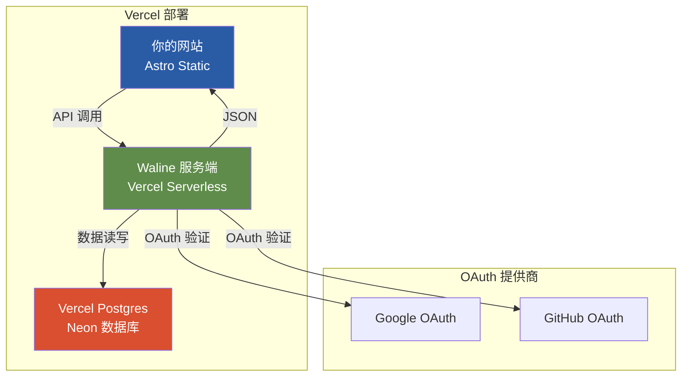

# Phase 4.2: Waline 评论系统 — 详细执行方案

> **目标**: 为所有文章详情页集成 Waline 评论系统，支持 Google/GitHub OAuth + 访客评论
> **存储后端**: Vercel Postgres (Neon) — 标准 PostgreSQL，易于迁移
> **交付状态**: 五类详情页 (media, gear, training, routes, events) 底部均可评论，支持 zh/en/de 三语切换

---

## Context

### 为什么选择 Waline？

原有 Giscus 方案有以下局限：

- 只支持 GitHub 登录，非技术用户门槛高
- 俱乐部成员不一定有 GitHub 账号

Waline 解决了这些问题：

- ✅ Google OAuth（普适性强）
- ✅ GitHub OAuth（技术用户友好）
- ✅ 访客模式（邮箱+昵称，无需任何账号）
- ✅ 可部署在 Vercel（与网站同平台）
- ✅ Vercel Postgres 存储（标准 SQL，易迁移）
- ✅ 支持微信/QQ（后续扩展 Phase 4.2.2）

### 当前 Infra 复用

Phase 4.2 已完成的基础设施可直接复用：

- `GiscusComments.astro` → 重构为 `WalineComments.astro`
- `ArticleLayout.astro` 的评论集成点（已就位）
- `routes/[slug].astro` 的评论集成点（已就位）
- `events/[slug].astro` 详情页（已创建）
- i18n 翻译键 `comments.title` / `comments.description`

---

## 架构设计

### 系统架构



### 存储后端对比

| 方案                      | 迁移难度            | Vercel 集成     | 免费额度            | 推荐度     |
| ------------------------- | ------------------- | --------------- | ------------------- | ---------- |
| **Vercel Postgres** | ⭐ 简单（标准 PG）  | ⭐⭐⭐ 原生     | 256MB + 10万操作/月 | ⭐⭐⭐⭐⭐ |
| LeanCloud                 | ⭐⭐ 需导出脚本     | ⭐⭐ 需额外配置 | 1GB + 3万请求/天    | ⭐⭐⭐     |
| MySQL                     | ⭐ 简单（标准 SQL） | ⭐⭐ 需自建     | 取决于托管商        | ⭐⭐⭐⭐   |

**选择 Vercel Postgres 的理由**：

- PostgreSQL 是关系型数据库标准，任何云平台都支持
- 未来迁移到 Railway/Render/自建服务器只需 `pg_dump` + 导入
- Vercel 一键部署，环境变量自动配置
- 与 Waline 深度集成，零配置

---

## OAuth 登录支持

### Phase 4.2.1: 核心登录方式（本次实施）

| OAuth 提供商       | 配置难度 | 用户体验  | 优先级  |
| ------------------ | -------- | --------- | ------- |
| **访客模式** | 无需配置 | 邮箱+昵称 | P0 必备 |
| **Google**   | 简单     | 一键登录  | P0 核心 |
| **GitHub**   | 简单     | 一键登录  | P0 核心 |

### Phase 4.2.2: 扩展登录方式（后续可选）

详细方案见: [`phase_4_2_2_wechat_plan.md`](./phase_4_2_2_wechat_plan.md)

| OAuth 提供商        | 配置难度 | 说明                            |
| ------------------- | -------- | ------------------------------- |
| **WeChat**    | 复杂     | 需要企业资质或第三方 OAuth 服务 |
| **QQ**        | 复杂     | 同上                            |
| **Facebook**  | 简单     | 欧美用户适用                    |
| **Twitter/X** | 简单     | 技术向用户                      |

---

## 执行步骤

### Step 0: Vercel Postgres 创建（用户手动完成）

1. 前往 Vercel Dashboard → 你的项目 → Storage
2. 点击 "Create Database" → 选择 "Postgres" → 基于 Neon
3. 选择免费计划（Hobby Plan - Free）
4. 记录以下环境变量（Vercel 自动添加到项目）：

   - `POSTGRES_URL`
   - `POSTGRES_PRISMA_URL`
   - `POSTGRES_URL_NON_POOLING`
   - `POSTGRES_USER`
   - `POSTGRES_HOST`
   - `POSTGRES_PASSWORD`
   - `POSTGRES_DATABASE`

   ```
   From Vercel Neon: 
   # Recommended for most uses
   DATABASE_URL=postgresql://<user>:<password>@<pooled-host>/<database>?sslmode=require

   # For uses requiring a connection without pgbouncer
   DATABASE_URL_UNPOOLED=postgresql://<user>:<password>@<unpooled-host>/<database>?sslmode=require

   # Parameters for constructing your own connection string
   PGHOST=<pooled-host>
   PGHOST_UNPOOLED=<unpooled-host>
   PGUSER=<user>
   PGDATABASE=<database>
   PGPASSWORD=<password>

   # Parameters for Vercel Postgres Templates
   POSTGRES_URL=postgresql://<user>:<password>@<pooled-host>/<database>?sslmode=require
   - `POSTGRES_URL` 等系列变量（通过 Connect Store 自动获取）

### Step 1: 部署 Waline 服务端

#### 方式 A: Vercel 一键部署（推荐）

1. 访问 Waline 官方 Vercel 模板：https://vercel.com/new/clone?repo=walinejs/waline
2. **Repository Name**: 输入 `acc-clubhub-waline`
3. **Environment Variables**: **不要填写**，直接点击 **Deploy**
   - *注意：首次部署会失败或报错，这是正常的，因为还没连数据库*
4. **连接数据库 (核心步骤)**:
   - 部署结束后，点击 **Continue to Dashboard**
   - 顶部菜单点击 **Storage** -> **Connect Store**
   - 选择在 **Step 0** 创建的数据库
   - **Environment**: 全选 (Production, Preview, Development)
   - **Custom Prefix**: <span style="color:red">**必须改为 `POSTGRES`**</span> (默认是 STORAGE)
     - *Waline 只识别 `POSTGRES_` 开头的变量*
   - 点击 **Connect**

5. **配置其他变量**:
   - 顶部菜单点击 **Settings** -> **Environment Variables**
   - 添加以下变量：
     - `SITE_NAME`: `ACC ClubHub`
     - `SITE_URL`: `https://your-acc-clubhub.vercel.app` (您的前端域名)
     - `JWT_SECRET`: (随机生成一串字符，越长越好)

6. **重新部署**:
   - 顶部菜单点击 **Deployments**
   - 找到最新的部署记录，点击最右侧 **三个点 (...)** -> **Redeploy**
   - 等待部署变绿 (Ready)
   - 记录服务端 URL：`https://acc-clubhub-waline.vercel.app`

#### 方式 B: 自建仓库部署

1. Fork https://github.com/walinejs/waline
2. 在 Vercel 导入你的 fork
3. 配置环境变量

#### 必需的环境变量

```bash
# 数据库配置（使用 Vercel Postgres）
POSTGRES_HOST=${POSTGRES_HOST}
POSTGRES_DB=${POSTGRES_DATABASE}
POSTGRES_USER=${POSTGRES_USER}
POSTGRES_PASSWORD=${POSTGRES_PASSWORD}
POSTGRES_PORT=5432

# Waline 配置
# Waline 服务端会自动创建表结构
# 不需要额外配置，Waline 会自动处理数据库初始化

# 管理员邮箱（可选，用于通知）
SITE_NAME=ACC ClubHub
SITE_URL=https://your-acc-clubhub.vercel.app
```

### Step 2: 配置 OAuth 提供商

#### GitHub OAuth

1. 前往 https://github.com/settings/developers
2. 点击 "New OAuth App"
3. 填写：
   - Application name: `ACC ClubHub Waline`
   - Homepage URL: `https://your-waline.vercel.app`
   - Authorization callback URL: `https://your-waline.vercel.app/oauth/github`
4. 创建后获得 `Client ID` 和 `Client Secret`
5. 在 Waline Vercel 项目中添加环境变量：
   - `GITHUB_CLIENT_ID=xxx`
   - `GITHUB_CLIENT_SECRET=xxx`

#### Google OAuth

1. 前往 https://console.cloud.google.com/
2. 创建新项目或选择现有项目
3. 启用 Google+ API
4. 创建 OAuth 2.0 凭据：
   - 类型: Web application
   - Authorized redirect URI: `https://your-waline.vercel.app/oauth/google`
5. 在 Waline Vercel 项目中添加环境变量：
   - `GOOGLE_CLIENT_ID=xxx`
   - `GOOGLE_CLIENT_SECRET=xxx`

### Step 3: 安装 Waline 客户端依赖

```bash
cd frontend
npm install @waline/client
```

### Step 4: 创建 WalineComments.astro 组件

**文件**: `frontend/src/components/WalineComments.astro`

职责：

- 接受 `lang` prop，传递给 Waline 客户端
- 渲染评论区标题 + 说明文字（复用现有 i18n）
- 初始化 Waline 客户端（使用 `client:load` 指令）
- Scoped 样式匹配 Blaue Reiter V3

关键实现：

```astro
---
import { t, type Locale } from '../lib/i18n';

interface Props {
  lang: Locale;
}

const { lang } = Astro.props;

// Waline 语言映射
const walineLangMap: Record<string, string> = {
  zh: 'zh-CN',
  en: 'en',
  de: 'de',
};
const walineLang = walineLangMap[lang] || 'en';
---

<section class="comments-section">
  <h2>{t(lang, 'comments.title')}</h2>
  <p class="comments-desc">{t(lang, 'comments.description')}</p>
  <div class="waline-wrapper" id="waline"></div>
</section>

<!-- Waline 客户端脚本 -->
<script>
  import { init } from '@waline/client';

  init({
    el: '#waline',
    serverURL: 'https://your-waline.vercel.app',
    lang: '{walineLang}',
    requiredMeta: ['nick', 'mail'],
    dark: 'html[data-theme="dark"]',
  });
</script>
```

### Step 5: 更新 i18n 翻译文案

**文件**: `frontend/src/lib/i18n.ts`

更新评论描述文案（去除 "GitHub" 限定）：

```typescript
// zh
'comments.description': '使用 Google/GitHub 账号或邮箱参与讨论',

// en
'comments.description': 'Join with Google/GitHub or email',

// de
'comments.description': 'Nehmen Sie mit Google/GitHub oder E-Mail teil',
```

### Step 6: 替换评论组件引用

**文件**:

- `frontend/src/layouts/ArticleLayout.astro`
- `frontend/src/pages/[lang]/routes/[slug].astro`

修改导入语句：

```astro
- import GiscusComments from '../components/GiscusComments.astro';
+ import WalineComments from '../components/WalineComments.astro';
```

修改组件调用：

```astro
- <GiscusComments lang={lang} />
+ <WalineComments lang={lang} />
```

### Step 7: 删除/归档旧组件

**文件**: `frontend/src/components/GiscusComments.astro`

- 可选择删除或移至 `frontend/src/components/_archive/`

### Step 8: 本地验证 + 构建

```bash
cd frontend
npm run build
```

验证点：

- 构建成功，无 TypeScript 错误
- `@waline/client` 正确打包
- 五类详情页路由正确生成

### Step 9: Vercel 部署测试

1. 推送代码到 GitHub
2. Vercel 自动部署
3. 访问任意详情页（如 `/zh/media/alps-summer-2025`）
4. 测试评论功能：
   - [ ] 访客模式（邮箱+昵称）
   - [ ] Google 登录
   - [ ] GitHub 登录
   - [ ] 三语切换

### Step 10: 访问 Waline 管理后台

首次部署后，访问 `https://your-waline.vercel.app/ui`：

1. 注册第一个账号（自动成为管理员）
2. 配置反垃圾策略
3. 审核评论（可选）

---

## 文件修改清单

| 文件                                              | 操作           | 说明                               |
| ------------------------------------------------- | -------------- | ---------------------------------- |
| `frontend/package.json`                         | **修改** | 添加 `@waline/client` 依赖       |
| `frontend/src/lib/i18n.ts`                      | **修改** | 更新 comments.description 翻译文案 |
| `frontend/src/components/WalineComments.astro`  | **新建** | Waline 评论组件                    |
| `frontend/src/components/GiscusComments.astro`  | **删除** | 归档或删除                         |
| `frontend/src/layouts/ArticleLayout.astro`      | **修改** | 替换导入和组件调用                 |
| `frontend/src/pages/[lang]/routes/[slug].astro` | **修改** | 替换导入和组件调用                 |

---

## 验证清单

### 部署前检查

- [ ] Vercel Postgres 数据库已创建
- [ ] Waline 服务端已部署到 Vercel
- [ ] GitHub OAuth App 已创建
- [ ] Google OAuth 凭据已创建
- [ ] 环境变量已配置（至少 9 个 `POSTGRES_*` 变量）

### 代码变更检查

- [ ] `@waline/client` 已安装
- [ ] `WalineComments.astro` 已创建
- [ ] `ArticleLayout.astro` 已更新
- [ ] `routes/[slug].astro` 已更新
- [ ] `GiscusComments.astro` 已删除/归档
- [ ] i18n 翻译文案已更新
- [ ] `npm run build` 构建成功

### 部署后功能测试

- [ ] Vercel 部署成功
- [ ] 访客评论功能正常
- [ ] Google 登录功能正常
- [ ] GitHub 登录功能正常
- [ ] 三语切换正常
- [ ] Waline 管理后台可访问

---

## 未来扩展

### 平台迁移

详细方案见: [`future_deployment_plan.md`](./future_deployment_plan.md)

由于使用 Vercel Postgres（标准 PostgreSQL），迁移路径清晰：

```
Vercel Postgres → Railway / Render / 自建服务器
```

步骤：

1. 使用 `pg_dump` 导出数据库
2. 在新平台创建 Postgres 实例
3. 导入 SQL 文件
4. 更新 Waline 服务端 `POSTGRES_*` 环境变量
5. 重新部署 Waline 服务端
6. 前端无需改动（只需更新 `serverURL`）

### 功能扩展

详见: [`phase_4_2_2_wechat_plan.md`](./phase_4_2_2_wechat_plan.md)

- 微信/QQ 登录
- 反垃圾策略 (Akismet)
- 邮件通知
