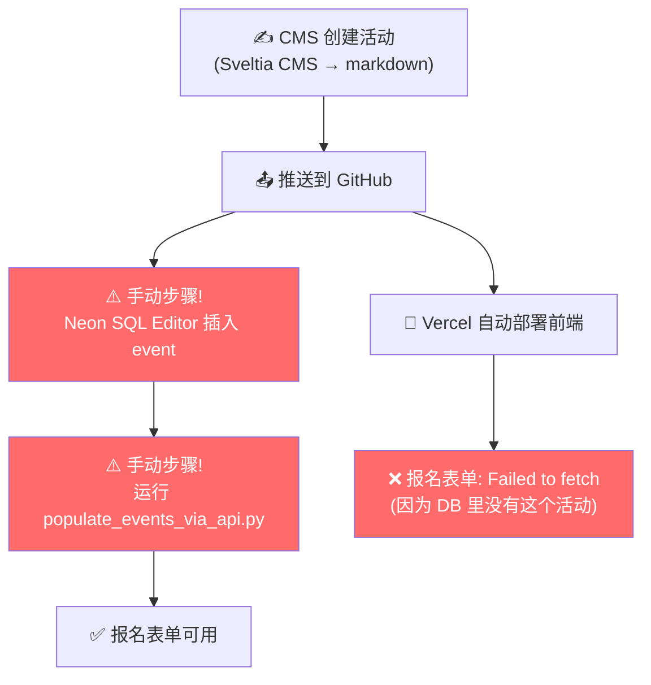
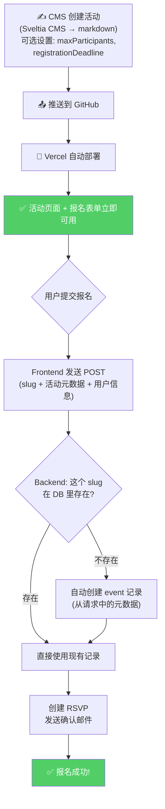
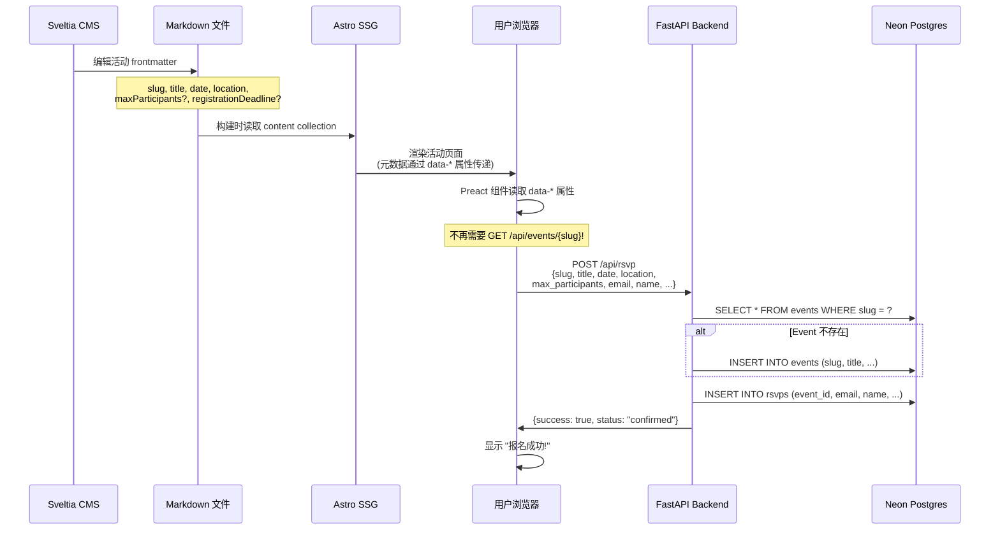

# Phase 4.3.3: CMS-Driven Event Registration

> **状态**: 📋 计划中
> **前置依赖**: Phase 4.3.1 (基础报名系统) ✅
> **父文档**: `docs/rebuild_plan/phase_4_3_events_plan.md`
> **架构决策 #10**: Astro `<script>` 变量传递 → 使用 `data-*` 属性 (已在 WalineComments 验证)
> **目标**: 消除手动数据库维护，让 CMS markdown 成为活动的唯一数据源

---

## 一、问题分析

### 当前架构（有问题）



**问题**: 每次在 CMS 创建新活动后，都要手动去 Neon SQL Editor 执行 SQL 和运行脚本。忘了就会出现 "Failed to fetch" 或 "无法加载报名表单"。

### 目标架构（CMS 驱动）



---

## 二、核心设计原则

| 原则 | 说明 |
|------|------|
| **Markdown 是唯一数据源** | 活动内容、标题、日期、地点全部从 markdown frontmatter 获取 |
| **DB 只存交互数据** | 数据库只负责: RSVP 记录、等待名单、参与人数统计 |
| **按需自动创建** | 第一次收到报名时自动在 DB 创建 event 记录，无需预先配置 |
| **零手动操作** | CMS → 推送 → 上线，不需要任何 SQL 或脚本 |

---

## 三、数据流详解



---

## 四、实施方案

### 改动 1: 扩展 Events Schema (`frontend/src/content.config.ts`)

在 events collection schema 添加可选的报名配置字段:

```typescript
// 新增字段
maxParticipants: z.number().optional(),           // 最大参与人数 (不设 = 无限制)
registrationDeadline: z.coerce.date().optional(), // 报名截止时间
registrationLink: z.string().optional(),          // 外部报名链接 (有则不显示内建表单)
```

CMS 编辑活动时可以设置:
```yaml
---
slug: summer-alps-2025
title: 2025 阿尔卑斯夏日骑行
location: 慕尼黑中央火车站集合
date: 2025-07-15
eventType: training-camp
maxParticipants: 20          # 可选
registrationDeadline: 2025-07-10  # 可选
---
```

### 改动 2: 简化活动页面 (`frontend/src/pages/[lang]/events/[slug].astro`)

**删除**: 客户端 `<script>` 中的 `fetch(${apiUrl}/api/events/${slug})` 调用（即两步 fetch 的第一步）

**改为**: 将 markdown 元数据直接通过 `data-*` 属性传递给 Preact 组件:

```html
<div
  id="registration-container"
  data-slug={entry.data.slug}
  data-title={entry.data.title}
  data-location={entry.data.location}
  data-event-date={entry.data.date}
  data-event-type={entry.data.eventType}
  data-max-participants={entry.data.maxParticipants ?? ''}
  data-registration-deadline={entry.data.registrationDeadline ?? ''}
  data-lang={lang}
  data-api-url={apiUrl}
/>
```

客户端脚本直接从 `data-*` 读取属性并渲染表单，不再做任何 API 调用。

### 改动 3: 重构报名表单组件 (`frontend/src/components/EventRegistrationForm.tsx`)

**Props 变更**:

```typescript
// 旧 Props (依赖后端数据)
interface EventRegistrationFormProps {
    eventId: number;          // ❌ 删除 — 不再需要数字 ID
    eventSlug: string;
    availableSpots: number | null;
    isDeadlinePassed: boolean;
    lang: Locale;
    apiUrl: string;
}

// 新 Props (全部来自 markdown)
interface EventRegistrationFormProps {
    eventSlug: string;
    eventTitle: string;
    eventLocation: string;
    eventDate: string;
    eventType: string;
    maxParticipants: number | null;
    registrationDeadline: string | null;
    lang: Locale;
    apiUrl: string;
}
```

**提交逻辑变更**:

```typescript
// 旧: POST /api/events/{eventId}/rsvp  (需要数字 ID)
// 新: POST /api/rsvp                    (slug-based, 带活动元数据)

const response = await fetch(`${apiUrl}/api/rsvp`, {
    method: 'POST',
    headers: { 'Content-Type': 'application/json' },
    body: JSON.stringify({
        // 用户信息
        email: formData.email,
        name: formData.name,
        notes: formData.notes,
        privacy_accepted: formData.privacy_accepted,
        subscribe: formData.subscribe,
        lang,
        // 活动元数据 (来自 markdown)
        event_slug: eventSlug,
        event_title: eventTitle,
        event_location: eventLocation,
        event_date: eventDate,
        event_type: eventType,
        max_participants: maxParticipants,
        registration_deadline: registrationDeadline,
    }),
});
```

**Deadline 检查**: 在组件内部用 `registrationDeadline` prop 直接比较 `new Date()`，不再依赖后端返回值。

### 改动 4: 新 RSVP 端点 (`backend/routes/rsvp.py`)

**新增** `POST /api/rsvp` (slug-based, 自动创建 event):

```python
class RSVPCreateV2(BaseModel):
    """CMS-driven RSVP request — 包含活动元数据"""
    # 用户信息
    email: EmailStr
    name: str
    notes: Optional[str] = None
    privacy_accepted: bool = False
    subscribe: bool = False
    lang: str = "zh"

    # 活动元数据 (来自 markdown frontmatter)
    event_slug: str
    event_title: str
    event_location: str = ""
    event_date: str              # ISO date string
    event_type: str = "social-ride"
    max_participants: Optional[int] = None
    registration_deadline: Optional[str] = None
```

**核心逻辑**:

```python
@router.post("/api/rsvp")
def create_rsvp_v2(data: RSVPCreateV2, db: Session = Depends(get_db)):
    # 1. Get or create event by slug
    event = db.query(Event).filter(Event.slug == data.event_slug).first()
    if not event:
        event = Event(
            slug=data.event_slug,
            title=data.event_title,
            location=data.event_location,
            event_date=parse_datetime(data.event_date),
            event_type=data.event_type,
            max_participants=data.max_participants,
            registration_deadline=parse_datetime(data.registration_deadline),
        )
        db.add(event)
        db.flush()  # 获取 event.id

    # 2. 后续逻辑与现有 create_rsvp 相同:
    #    检查 privacy_accepted, deadline, 重复报名, 席位...
    #    创建 RSVP, 处理订阅, 发送邮件
```

**保留旧端点**: `POST /api/events/{event_id}/rsvp` 保留不删，避免 breaking change。新前端使用新端点。

### 改动 5: 可删除的代码

| 文件 | 可删除内容 |
|------|-----------|
| `backend/scripts/populate_events_via_api.py` | 整个文件（不再需要手动同步） |
| `backend/scripts/sync_events.py` | 整个文件（不再需要手动同步） |

---

## 五、Markdown Frontmatter 对照表

| frontmatter 字段 | DB 字段 | 必填 | 说明 |
|---|---|---|---|
| `slug` | `events.slug` | ✅ | 活动唯一标识 |
| `title` | `events.title` | ✅ | 活动名称 |
| `location` | `events.location` | ✅ | 活动地点 |
| `date` | `events.event_date` | ✅ | 活动日期 |
| `eventType` | `events.event_type` | 否 | 默认 `social-ride` |
| `maxParticipants` | `events.max_participants` | 否 | 不设 = 无限制报名 |
| `registrationDeadline` | `events.registration_deadline` | 否 | 不设 = 无截止日期 |
| `registrationLink` | —  | 否 | 有此字段时使用外部链接，不显示内建表单 |

---

## 六、文件变更清单

| 文件 | 操作 | 改动量 |
|------|------|--------|
| `frontend/src/content.config.ts` | 修改 | 3 行 (添加可选字段) |
| `frontend/src/pages/[lang]/events/[slug].astro` | 修改 | 重写 `<script>` 部分 (~30 行) |
| `frontend/src/components/EventRegistrationForm.tsx` | 修改 | Props + submit 逻辑 (~40 行) |
| `backend/routes/rsvp.py` | 修改 | 新增 `RSVPCreateV2` + `POST /api/rsvp` (~60 行) |
| `backend/scripts/populate_events_via_api.py` | 删除 | 不再需要 |
| `backend/scripts/sync_events.py` | 删除 | 不再需要 |

---

## 七、验证方案

### 自动验证

```bash
cd frontend && npm run check    # TypeScript 类型检查
cd frontend && npm run test     # 单元测试
cd frontend && npm run build    # SSG 构建成功
```

### 手动验证

1. **新活动零配置**: 在 `content/events/zh/` 新建一个 `.md` 活动，只填 frontmatter → 构建 → 访问活动页 → 报名表单直接显示（无 "Failed to fetch"）
2. **报名提交**: 提交报名 → 后端自动创建 event 记录 → RSVP 成功 → 收到确认邮件
3. **席位限制**: 设置 `maxParticipants: 2` → 报名 2 人后显示 "已满员" / 等待名单
4. **截止日期**: 设置 `registrationDeadline: 2020-01-01` (过去日期) → 表单显示 "报名已截止"
5. **外部链接**: 设置 `registrationLink: https://example.com` → 显示外部链接按钮，不显示内建表单
