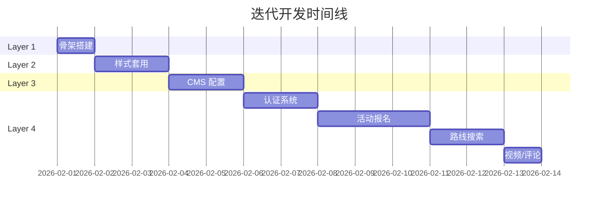

# ACC ClubHub 迭代开发流程

> **理念**: 搭乐高，先骨架、后样式、再功能  
> **原则**: 每一层完成后都是可运行、可预览的状态

---

## 开发层次总览

```
┌─────────────────────────────────────────────────────┐
│  Layer 4: 功能模块                                   │
│  ┌─────────────────────────────────────────────────┐│
│  │  Layer 3: 内容系统                               ││
│  │  ┌─────────────────────────────────────────────┐││
│  │  │  Layer 2: 样式皮肤                           │││
│  │  │  ┌─────────────────────────────────────────┐│││
│  │  │  │  Layer 1: 骨架结构                       ││││
│  │  │  │  (HTML 结构 + 导航 + 占位符)              ││││
│  │  │  └─────────────────────────────────────────┘│││
│  │  │  (蓝骑士 CSS + 组件样式)                     │││
│  │  └─────────────────────────────────────────────┘││
│  │  (Decap CMS + 内容集合)                         ││
│  └─────────────────────────────────────────────────┘│
│  (认证 + 报名 + 搜索 + 邮件)                         │
└─────────────────────────────────────────────────────┘
```

---

## Layer 1: 骨架 (Skeleton)

> **目标**: 网站能跑起来，所有页面能点击，内容用占位符

### 交付物

```
frontend/
├── src/
│   ├── layouts/
│   │   └── BaseLayout.astro      # 基础布局 (无样式)
│   ├── components/
│   │   ├── Header.astro          # 导航栏骨架
│   │   └── Footer.astro          # 页脚骨架
│   ├── pages/
│   │   ├── index.astro           # 首页 (占位)
│   │   ├── events/
│   │   │   └── index.astro       # 慕城日常 (占位)
│   │   ├── media/
│   │   │   └── index.astro       # 车影骑踪 (占位)
│   │   ├── knowledge/
│   │   │   ├── gear.astro        # 器械知识 (占位)
│   │   │   └── training.astro    # 科学训练 (占位)
│   │   ├── routes/
│   │   │   └── index.astro       # 骑行路线库 (占位)
│   │   └── about.astro           # 关于 ACC (占位)
│   └── styles/
│       └── base.css              # 最小化 CSS (仅 reset)
├── public/
│   └── images/
│       └── logo.jpg              # Logo
└── astro.config.mjs
```

### 占位符规范

每个页面使用统一占位模板：

```astro
---
import BaseLayout from '../layouts/BaseLayout.astro';
---
<BaseLayout title="页面标题">
  <main>
    <h1>页面标题</h1>
    <p class="placeholder">🚧 此功能正在建设中...</p>
    
    <!-- 功能区占位 -->
    <section class="feature-placeholder">
      <h2>待实现: XXX 功能</h2>
      <ul>
        <li>功能点 1</li>
        <li>功能点 2</li>
      </ul>
    </section>
  </main>
</BaseLayout>
```

### 验证点
- [ ] `npm run dev` 启动成功
- [ ] 导航栏所有链接可点击
- [ ] 每个页面都能访问

### 预计时间: 2-3 小时

---

## Layer 2: 样式 (Style)

> **目标**: 套上蓝骑士设计系统，网站变好看

### 交付物

```
frontend/src/styles/
├── blaue-reiter.css              # 从原项目迁移
├── variables.css                 # CSS 变量提取
└── components/
    ├── header.css
    ├── footer.css
    ├── cards.css
    └── buttons.css
```

### 任务清单

| 任务 | 说明 |
|------|------|
| 迁移 CSS 变量 | 颜色、字体、角度 |
| Header 样式 | 导航栏 + 下划线动效 |
| Footer 样式 | 简约页脚 |
| 卡片组件 | 用于活动/文章列表 |
| 按钮组件 | Primary / Ghost 样式 |
| 首页 Hub | 中央导航设计 |

### 验证点
- [ ] 首页呈现蓝骑士风格
- [ ] 导航栏有悬停动效
- [ ] 按钮有倾斜 + 硬阴影

### 预计时间: 4-6 小时

---

## Layer 3: 内容 (Content)

> **目标**: CMS 可用，能发布文章

### 交付物

```
frontend/
├── public/admin/
│   ├── index.html                # Decap CMS 入口
│   └── config.yml                # CMS 配置
└── src/content/
    ├── config.ts                 # 内容集合定义
    ├── media/                    # 车影骑踪
    │   └── _schema.md
    ├── knowledge/
    │   ├── gear/                 # 器械知识
    │   └── training/             # 科学训练
    └── routes/                   # 骑行路线
        └── _schema.md
```

### CMS 配置骨架

```yaml
# public/admin/config.yml
backend:
  name: github
  repo: GenLI3202/acc_clubhub
  branch: main
  base_url: https://acc-club.com  # OAuth 回调

collections:
  - name: media
    label: "🎬 车影骑踪"
    folder: "frontend/src/content/media"
    create: true
    fields:
      - { label: "标题", name: "title", widget: "string" }
      - { label: "类型", name: "type", widget: "select", 
          options: ["影像", "访谈", "翻山越岭"] }
      - { label: "视频链接", name: "videoUrl", widget: "string", required: false }
      - { label: "内容", name: "body", widget: "markdown" }

  - name: knowledge-gear
    label: "🔧 器械知识"
    folder: "frontend/src/content/knowledge/gear"
    create: true
    fields:
      - { label: "标题", name: "title", widget: "string" }
      - { label: "作者", name: "author", widget: "string" }
      - { label: "内容", name: "body", widget: "markdown" }

  - name: knowledge-training
    label: "📊 科学训练"
    folder: "frontend/src/content/knowledge/training"
    create: true
    fields:
      - { label: "标题", name: "title", widget: "string" }
      - { label: "作者", name: "author", widget: "string" }
      - { label: "内容", name: "body", widget: "markdown" }

  - name: routes
    label: "🗺️ 骑行路线"
    folder: "frontend/src/content/routes"
    create: true
    fields:
      - { label: "路线名", name: "name", widget: "string" }
      - { label: "区域", name: "region", widget: "string" }
      - { label: "距离(km)", name: "distance", widget: "number" }
      - { label: "爬升(m)", name: "elevation", widget: "number" }
      - { label: "难度", name: "difficulty", widget: "select",
          options: ["easy", "medium", "hard", "expert"] }
      - { label: "Strava链接", name: "stravaUrl", widget: "string", required: false }
      - { label: "Komoot链接", name: "komootUrl", widget: "string", required: false }
      - { label: "描述", name: "body", widget: "markdown" }
```

### 验证点
- [ ] 访问 `/admin` 能看到 CMS 界面
- [ ] 创建测试文章成功
- [ ] 文章在对应页面显示

### 预计时间: 4-5 小时

---

## Layer 4: 功能 (Features)

> **目标**: 核心交互功能上线

### 4.1 认证系统

| 交付物 | 说明 |
|-------|------|
| `frontend/src/lib/supabase.ts` | Supabase 客户端 |
| `frontend/src/components/AuthButton.astro` | 登录/登出按钮 |
| `backend/auth.py` | JWT 验证中间件 |

### 4.2 活动报名 (慕城日常)

| 交付物 | 说明 |
|-------|------|
| `backend/routes/events.py` | 活动 CRUD API |
| `backend/routes/rsvp.py` | 报名 API |
| `frontend/src/components/EventCard.astro` | 活动卡片 |
| `frontend/src/components/RegisterForm.astro` | 报名表单 |
| `backend/services/email.py` | Resend 邮件 |

### 4.3 路线搜索

| 交付物 | 说明 |
|-------|------|
| `frontend/src/lib/search.ts` | Fuse.js 搜索 |
| `frontend/src/components/RouteFilter.astro` | 筛选器组件 |
| `frontend/src/components/RouteCard.astro` | 路线卡片 |

### 4.4 视频嵌入

| 交付物 | 说明 |
|-------|------|
| `frontend/src/components/VideoEmbed.astro` | YouTube/Bilibili iframe |

### 4.5 评论

| 交付物 | 说明 |
|-------|------|
| `frontend/src/components/Comments.astro` | Giscus 集成 |

### 验证点
- [ ] Google 登录成功
- [ ] 创建活动 → 报名 → 收到邮件
- [ ] 搜索路线返回正确结果
- [ ] 视频能嵌入播放
- [ ] 评论能发布

### 预计时间: 12-15 小时

---

## 开发顺序建议



---

## 里程碑检查点

| 里程碑 | 完成标志 | 可演示内容 |
|-------|---------|-----------|
| **M1** | Layer 1 完成 | 灰色骨架网站，所有页面可访问 |
| **M2** | Layer 2 完成 | 蓝骑士风格网站，视觉完整 |
| **M3** | Layer 3 完成 | CMS 可用，能发布内容 |
| **M4** | Layer 4 完成 | 全功能网站上线 |

---

准备好后告诉我，我从 **Layer 1: 骨架** 开始搭建！
